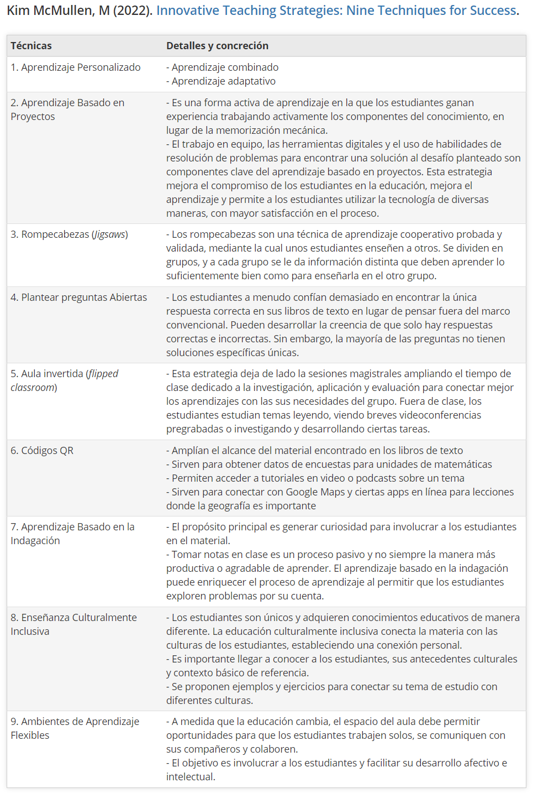
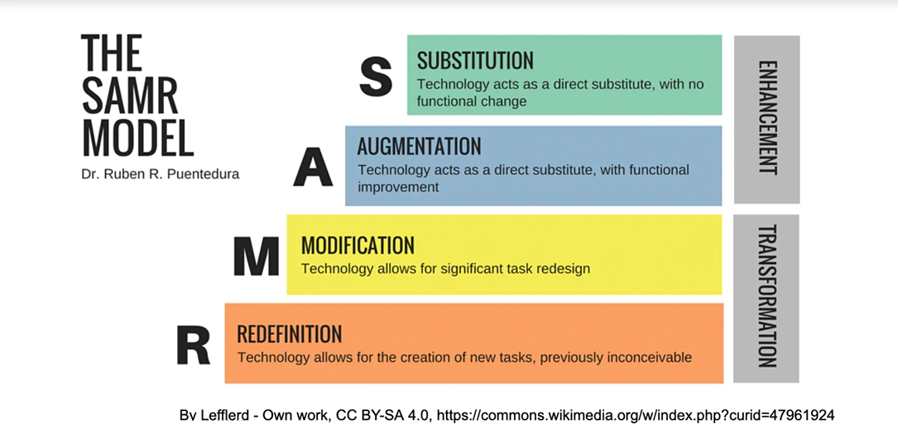
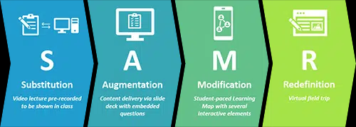
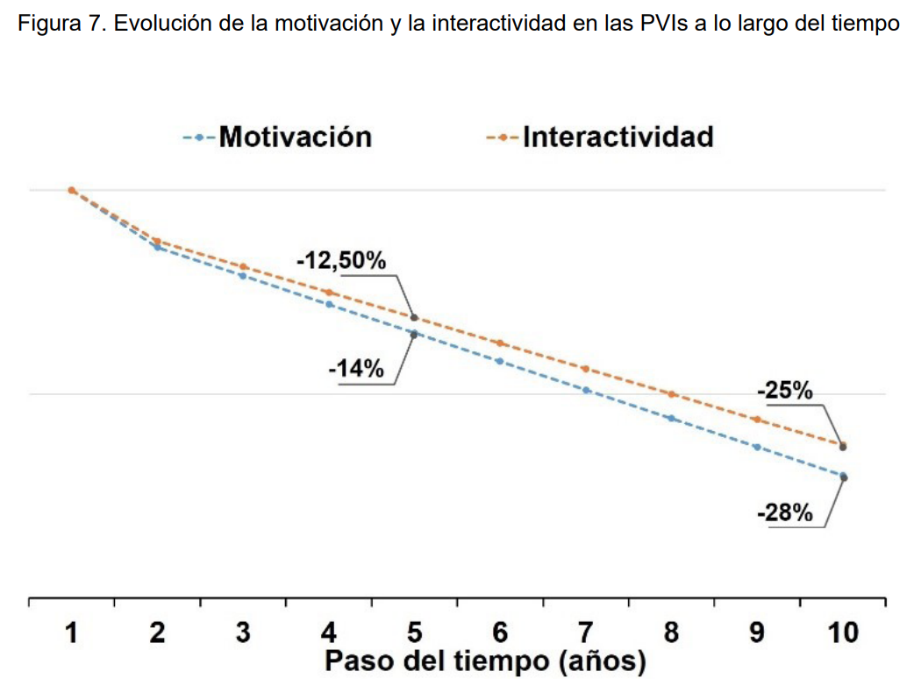

# Innovación educativa y tecnologías de soporte

### *Monografía técnica SG1.56.1.57 - v2. 2024*  
Miguel Moreno  
Universidad de Granada  

<p></p>

<p xmlns:cc="http://creativecommons.org/ns#" xmlns:dct="http://purl.org/dc/terms/">
<span property="dct:title">Licencia: <a href="http://creativecommons.org/licenses/by-nc-sa/4.0/?ref=chooser-v1" target="_blank" rel="license noopener noreferrer" style="display:inline-block;">CC BY-NC-SA 4.0</a></br>
<a href="https://doi.org/10.5281/zenodo.10643153"></a>

---


# Prefacio

Esta monografía proporciona elementos imprescindibles para adquirir una perspectiva informada y crítica sobre diversos enfoques pedagógicos innovadores, y las herramientas, plataformas y servicios asociados. Su estructura y diseño obedece a los requisitos formativos del programa de posgrado ofertado en la Universidad de Granada para estudiantes de ciencias sociales y jurídicas que eligen el itinerario de Filosofía (SG1/56/1/57), complementario del módulo común dedicado a *Innovación docente e Investigación educativa* en el <a href="https://masteres.ugr.es/profesorado/docencia/plan-de-estudios" target="_blank">Máster del Profesorado</a>.

El conjunto de técnicas, herramientas y enfoques aptos para ser utilizados en procesos y metodologías de innovación docente resulta virtualmente inabarcable. Puede incluir elementos y enfoques propios de enfoques muy convencionales, reorientados en combinación con técnicas y estrategias novedosas de interacción en línea y personalización de los aprendizajes. Pero aquí se ha optado por analizar y evaluar técnicas, soportes, plataformas y herramientas o servicios especialmente adecuados para abrir nuevas posibilidades dentro y fuera de las aulas, sin perder de vista el objetivo central: la mejora de resultados con mayor implicación y motivación de estudiantes y docentes.

Cualquier base de datos especializada devuelve miles de referencias bibliográficas de las tres últimas décadas dedicadas al impacto de las TIC y la digitalización en la educación. Muchas resultan redundantes o de escasa relevancia, a menudo ligadas a prejuicios o expectativas no satisfechas por la evolución tecnológica posterior. Por este motivo se ha considerado necesario revisar la literatura que aporta evidencia, resultados y datos de calidad sobre el impacto de diversas estrategias y herramientas con potencial para la innovación. En particular, se han revisado numerosos estudios aparecidos tras la disrupción que supuso la pandemia y la inmersión brusca en plataformas y metodologías de enseñanza en línea. 

En varios apartados se aportan elementos para una evaluación crítica, reflexiva e informada de diversas técnicas, herramientas, enfoques y esquemas organizativos que cierran o amplían las oportunidades de innovación, formación reglada y autoformación. Se analizan y cuestionan las razones más comunes para rechazar el cambio. En particular las referidas al coste de los recursos necesarios y a la dificultad para proporcionar una formación bajo demanda de actualización constante. Y se evalúa el impacto de la inteligencia artificial generativa por su potencial para promover itinerarios personalizados de alfabetización múltiple y generar recursos de calidad en pocos pasos y con instrucciones básicas. 

Las referencias se agrupan al final de los apartados donde son pertinentes, en bloques que se pueden abrir o contraer para no dificultar la lectura del texto principal. Los bloques de referencias se complementan en algunos apartados con estudios de caso, selección de enlaces, tablas y gráficos o esquemas. El sistema habitual de elaboración de textos académicos con notas a pie de página por capítulos o al final del texto acusa una dependencia excesiva del formato impreso. Para integrar los listados a veces extensos de enlaces, referencias y notas que sustentan las ideas y conclusiones en cada apartado he preferido incorporar en el formato HTML la posibilidad de copiar de un solo clic los bloques de enlaces o referencias —un componente de funcionalidad común en los manuales o documentación técnica con fragmentos de código— y facilitar así la comprobación de fuentes externas relacionadas con el contenido de cada sección. De este modo cada referencia ocupa una sola línea numerada, fácilmente identificable. En algunas secciones, ciertos términos y expresiones funcionan como notas clicables que muestran automáticamente autor/es, año y título de la referencia correspondiente al pasar el cursor. En los apartados más breves se ha evitado generar bloques separados de notas incluyendo los detalles de la referencia completa en un enlace activo a la fuente.

La documentación e indicaciones para los estudios de caso aparece como un bloque plegado que se expande al clicar, utilizando una combinación de las etiquetas `<details>` y `<summary>` para facilitar una lectura fluida y sin distracciones del texto principal. Mantener en un solo archivo HTML el bloque de texto principal, con la tabla de contenido al comienzo, permite navegar fácilmente por todas las secciones y realizar búsquedas de términos específicos en todo el documento. 

El listado completo de referencias utilizadas aparece en la sección <a href="#bibliografía" target="_blank">Bibliografía</a>, con sus enlaces clicables. Para copiar los bloques de referencias de otros apartados (incluidos en formato de texto plano) y obtener automáticamente sus enlaces activos pueden resultar útiles herramientas como [stackedit](https://stackedit.io/), [dillinger](https://dillinger.io/), [zettlr](https://www.zettlr.com/) o [editormarkdown](https://editormarkdown.com/). Se simplifica así el manejo de fuentes y su incorporación en aplicaciones de notas y bases de conocimiento como [notion](https://www.notion.so/), [obsidian](https://obsidian.md/), [joplin](https://joplinapp.org/) o [logseq](https://logseq.com/).
  
Otra razón para optar por el formato HTML son las funciones de *accesibilidad* y *personalización* del texto que incorporan los navegadores más utilizados. Esto explica en parte el interés por mantener un cuerpo de texto lo más simple y fluido posible. Estas funciones incluyen la posibilidad de traducir a cualquier idioma todo el contenido con un solo clic y, en los navegadores más utilizados, reproducir el texto con voces personalizables o hacer uso de funciones de legilibilidad (con extensiones como [Just Read](https://chromewebstore.google.com/detail/just-read/dgmanlpmmkibanfdgjocnabmcaclkmod&amp;rut=5e643e29e539d2f4b699703a0e5f8cf27954daf1310f2f8bd919be54ef0c77dd), p. ej.) para leer el texto sin distracciones, cambiando a un tema oscuro para facilitar mejor contraste y menor esfuerzo visual en la lectura.

> **Cómo citar**:  
> Moreno-Muñoz, Miguel (2024). *Innovación educativa y tecnologías de soporte*. Monografía técnica SG1.56.1.57 (v2 2024). Zenodo. https://doi.org/10.5281/zenodo.10643153. 


# Agradecimientos

Una parte de la documentación y recursos seleccionados procede de búsquedas y consultas para contribuir al debate informado en conferencias, cursos de doctorado y máster. La interacción con estudiantes de posgrado, en respuesta a preguntas y planteamientos que ampliaban la discusión a problemas no incluidos en la programación, ha servido para filtrar el listado de referencias y estudios sobre tendencias recientes en el ámbito de la educación superior. Es preciso agradecer las innumerables recomendaciones y sugerencias valiosas recibidas de colegas que amablemente comunicaban lo que les funcionaba en el aula; y sus alternativas para sortear ciertos inconvenientes. 

Los cursos de posgrado para formación del profesorado han servido de oportunidad para estar en contacto con grupos de estudiantes de distintas promociones altamente motivados, con excelente formación previa e involucrados en los debates y prácticas de clase. Su actitud crítica, criterio reflexivo y experiencias personales (en muchos casos tras haber completado algún máster de investigación o en la fase final del periodo de doctorado) contribuyeron a enriquecer las ideas, conceptos y opiniones recogidas en el texto. Otras intuiciones y aprendizajes surgieron en mis primeros pasos como docente de Filosofía en centros de Gran Canaria, donde tuve la oportunidad de participar en proyectos ambiciosos de innovación y mejora de la infraestructura educativa en aulas de Bachillerato. De esa época guardo muchos recuerdos imborrables de amistades, colegas y estudiantes que hicieron del trabajo una experiencia estimulante y grata.

En Granada, a 9 de febrero de 2024

---

# 1. La innovación docente y su concreción en las materias de Filosofía

## 1.1. Introducción: El concepto de innovación

Una revisión pormenorizada de las acepciones de los términos "innovar" e "innovación" en diversos diccionarios de referencia<sup>1-7</sup> proporciona al menos tres aspectos diferenciados:

1. La *introducción de algo nuevo* o la *modificación de algo establecido*: esta definición se centra en la novedad y el cambio que implica la innovación. Incluye matices como alteración, novedad, originalidad, nuevos elementos o formas. Ejemplos: introducción de un nuevo producto, servicio, proceso, método organizativo, etc.  

2. *Creación y comercialización de un nuevo producto*: esta definición pone el foco en la innovación aplicada a productos comerciales. Enfatiza la creación, mejora y lanzamiento al mercado. Ejemplos: innovación en el diseño y desarrollo de productos, reacción o adaptación a nuevas necesidades y demandas, etc.

3. *Renovación y progreso*: una definición más amplia que destaca los efectos positivos de la innovación. Se asocia con tipos de impacto percibidos como cambio, mejora, modernización, avance. Ejemplos: innovación para resolver problemas sociales, ambientales, impulsar el crecimiento económico o sortear ciertos inconvenientes de tecnologías obsoletas (más contaminantes, más costosas o menos eficientes). 

La innovación raramente es <a href="https://doi.org/10.3916/C38-2012-02-01"><span data-toggle="tooltip" title="M. Area-Moreira and M. T. Ribeiro-Pessoa (2012). From Solid to Liquid: New Literacies to the Cultural Changes of Web 2.0. Comunicar 19 (38): 13–20.">solo tecnológica</span></a>, pese a la atención que este factor suele recibir. Lo habitual es que surja de una dinámica de cambio más amplia en lo social, en la mejora u optimización de procesos y en la transformación de servicios, modelos de negocio y marco regulador, con impacto en las estructuras organizativas y formativas. Requiere creatividad y apertura al cambio, es decir, una evolución cultural constatable y nuevos valores de referencia. Puede generar resistencia —por romper con la comodidad de lo establecido— y sentimiento de exclusión entre ciertos colectivos con dificultades para adaptarse al cambio. Es un proceso continuo y acumulativo; pero también dialéctico y, en ocasiones, muy conflictivo.<sup>8-11</sup>

<details>
  <summary>Mostrar enlaces y referencias</summary>

```markdown
1. https://dle.rae.es/innovar
2. https://www.collinsdictionary.com/dictionary/english/innovation
3. https://www.collinsdictionary.com/es/diccionario/espanol-ingles/innovar
4. https://www.oed.com/search/advanced/Entries?textTermText0=innovation&textTermOpt0=Etymology
5. https://www.oed.com/search/advanced/Meanings?textTermText0=innovation&textTermOpt0=WordPhrase&tl=true
6. https://www.oed.com/search/advanced/Quotations?textTermText0=innovation&textTermOpt0=QuotText
7. https://www.oxfordlearnersdictionaries.com/definition/english/innovation?q=innovation
8. Hauerwas, L. B. et al. (2023). “Transformative Innovation in Teacher Education: Research toward a Critical Global Didactica.” Teaching and Teacher Education 123 (March): 103974. https://doi.org/10.1016/j.tate.2022.103974.
9. Bilichenko, O. et al. (2022). “Managing Strategic Changes in Personnel Resistance to Open Innovation in Companies.” Journal of Open Innovation: Technology, Market, and Complexity 8 (3): 151. https://doi.org/10.3390/joitmc8030151.
10. Talwar, S. et al. (2021). “Why Have Consumers Opposed, Postponed, and Rejected Innovations during a Pandemic? A Study of Mobile Payment Innovations.” Australasian Journal of Information Systems 25 (November). https://doi.org/10.3127/ajis.v25i0.3201.
11. Area-Moreira M.,and M. T. Ribeiro-Pessoa (2012). From Solid to Liquid: New Literacies to the Cultural Changes of Web 2.0. Comunicar 19 (38): 13–20. https://doi.org/10.3916/C38-2012-02-01.  
```

</details>

---

## 1.2. La innovación docente en los programas de Filosofía

El concepto de *innovación docente* refiere al conjunto de acciones, procesos y resultados orientados a la mejora de la calidad de la enseñanza y el aprendizaje en todas las etapas del sistema educativo. Se concreta introduciendo cambios en las prácticas, los contenidos, las metodologías, las herramientas, los recursos y los criterios e instrumentos de evaluación asociados con los procesos de enseñanza-aprendizaje, para adaptarlos a las características, necesidades, intereses y expectativas de los estudiantes y a la evolución del contexto amplio (sociocultural, técnico, económico y familiar) que les influye.

Forma parte del proceso de innovación docente la <a href="https://doi.org/10.1287/mnsc.35.8.982"><span data-toggle="tooltip" title="Davis, F.D. et al. (1989). User Acceptance of Computer Technology: A Comparison of Two Theoretical Models. Management Science, 35, 982-1003.">planificación</span></a>, selección y puesta a prueba de elementos que pueden suscitar cambios significativos en las prácticas y estrategias educativas. Aparte de satisfacer indicadores básicos de calidad, el objetivo central es lograr aprendizajes significativos propios de la etapa y ajustados a las capacidades de los estudiantes.<sup>1, 2</sup> 

En un sentido más amplio, se espera que la innovación contribuya a promover un entorno de educación más efectivo, inclusivo y motivador, en línea con el desarrollo científico-técnico y los desafíos complejos del siglo XXI, y sustentado en enfoques reflexivos respaldados por la evidencia.<sup>3, 4</sup> 

En el ámbito específico de la enseñanza de los contenidos de filosofía es inevitable manejar un repertorio amplio de estrategias, recursos y enfoques metodológicos que potencien en lo posible la finalidad instrumental de las materias filosóficas. Su introducción en la etapa preuniversitaria se justifica porque contribuyen al desarrollo del pensamiento crítico y de las actitudes reflexivas, creativas e inconformistas frente a estereotipos, convenciones y clichés comunes en la producción cultural, en los medios generalistas y en la esfera política. 

La adolescencia suele considerarse la etapa evolutiva decisiva para la maduración intelectual y ética de los estudiantes, como resultado de un proceso más amplio de consolidación de curiosidad e interés por la cultura, el conocimiento y las habilidades para el diálogo y la interacción social. Pero el interés o pertinencia de los contenidos y metodologías en la clase de filosofía se interpreta a menudo en función de retos, circunstancias y oportunidades diversas en el contexto social. Desde que finalizó la pandemia parece consolidarse la tendencia que cuestiona el papel de la tecnología y los dispositivos digitales en las aulas, sobre todo el uso de móviles con ciertas funciones avanzadas, aplicaciones de mensajería y conectividad permanente. 

Aspectos y servicios previamente muy demandados, como resultado de una conexión mucho más directa con la realidad social y la importancia de atender mejor a la diversidad, para fomentar la inclusión efectiva de estudiantes con dificultades complejas en su tipología y grado, se cargan en 2023-2024 de connotaciones muy negativas a partir de ciertos casos de acoso presencial o en línea.<sup>16</sup> Puesto que no se trata de sucesos aislados y pueden tener consecuencias graves para la convivencia que en absoluto cabe subestimar, es importante entender que se trata de una dinámica mucho más general y transversal que la constatada en las aulas, por lo que incidir solo o preferentemente en este ámbito social y profesional no va a resolver al problema.<sup>5-6</sup> 

La presión que ejercen colectivos de padres/madres sobre la autoridad educativa<sup>7</sup> para prohibir el uso de móviles en las aulas deja en segundo plano otros aspectos (ratio inmanejable en los grupos, carencias de formación afectiva en aspectos básicos, insuficiencia de medios para la atención psicológica temprana, limitaciones de los medios disponibles en el aula, etc.) que, muy probablemente, han contribuido al deterioro de aspectos esenciales en el proyecto pedagógico de los centros y en las metodologías de trabajo posibles, dadas las circunstancias.<sup>8-15</sup> 

En consecuencia, el análisis de las estrategias de innovación docente —que excede en alcance y complejidad lo que resulta aplicable en la enseñanza de la Filosofía— requiere un enfoque aplicado, ajustado a la naturaleza de una disciplina que aporta elementos decisivos para el desarrollo del pensamiento crítico, la actitud reflexiva y el enfoque original de problemas de cierta complejidad interdisciplinar.

<details>
  <summary>Mostrar referencias</summary>

```markdown
1. Barrio, M. et al. (eds., 2017). La Innovación Educativa Como Agente de Transformación Digital En La Educación Superior. Dykinson. https://doi.org/10.2307/j.ctt1zgwjb7.
2. Castro-Benavides, L. M. et al. (2022). “Escenarios de La Docencia Frente a La Transformación Digital de Las Instituciones de Educatión Superior.” Education in the Knowledge Society (EKS) 23 (November): e27866. https://doi.org/10.14201/eks.27866.
3. Losada, I. H. y Osuna, J. E. A. (2023). Innovación educativa y formación docente: Últimas aportaciones en la investigación. Esic. 99-198.
4. López-Meneses, A. y E. Martín-Padilla (2023). Educar para transformar: innovacion pedagogica, calidad y TIC en contextos formativos. S.l.: DYKINSON. https://dialnet.unirioja.es/servlet/libro?codigo=922543.
5. Suryanto, A. et al. (2022). “Study of Working from Home: The Impact of ICT Anxiety and Smartphone Addiction on Lecturers at NIPA School of Administration on Job Performance.” Heliyon 8 (12): e11980. https://doi.org/10.1016/j.heliyon.2022.e11980.
6. Lee, S. and Jaeho Jeon (2024). “Teacher Agency and ICT Affordances in Classroom-Based Language Assessment: The Return to Face-to-Face Classes after Online Teaching.” System 121 (April): 103218. https://doi.org/10.1016/j.system.2023.103218.
7. Consejo-Escolar-del-Estado. (2024). Propuestas del Consejo del Consejo Escolar del Estado sobre el uso de dispositivos móviles en los centros. Gob.es (Ministerio de Educación...). https://www.educacionyfp.gob.es/dam/jcr:5ab2371c-4f3e-4c4d-9090-b3afb18adcf8/cee-propuestas-dispositivos-moviles.pdf.
8. Duraiappah, A. et al. (2021). “Screen Time and Learner Well-Being: The Debate, the Evidence and Directions for Future Research and Policy. A Research Brief by UNESCO MGIEP.” https://d1c337161ud3pr.cloudfront.net/files%2Fcca79941-0187-480b-a737-f9a7eca1f38a_UNESCO%20MGIEP-Screentime.pdf.
9. Przybylski, A. et al. (2020). “How Much Is Too Much? Examining the Relationship Between Digital Screen Engagement and Psychosocial Functioning in a Confirmatory Cohort Study.” Journal of the American Academy of Child & Adolescent Psychiatry 59 (9): 1080–88. https://doi.org/10.1016/j.jaac.2019.06.017.
10. Adelantado-Renau, M. et al. (2019). “Association Between Screen Media Use and Academic Performance Among Children and Adolescents.” JAMA Pediatrics 173 (11): 1058. https://doi.org/10.1001/jamapediatrics.2019.3176.
11. Houghton, S. et al. (2015). “Virtually Impossible: Limiting Australian Children and Adolescents Daily Screen Based Media Use.” BMC Public Health 15 (1): 5. https://doi.org/10.1186/1471-2458-15-5.
12. Qi, J. et al. (2023). “Screen Time among School-Aged Children of Aged 6–14: A Systematic Review.” Global Health Research and Policy 8 (1): 12. https://doi.org/10.1186/s41256-023-00297-z.
13. Panjeti-Madan, V. N. and P. Ranganathan (2023). “Impact of Screen Time on Children’s Development: Cognitive, Language, Physical, and Social and Emotional Domains.” Multimodal Technologies and Interaction 7 (5): 52. https://doi.org/10.3390/mti7050052.
14. Msafiri, M. M. et al. (2023). “A Systematic Literature Review of ICT Integration in Secondary Education: What Works, What Does Not, and What Next?” Discover Education 2 (1): 44. https://doi.org/10.1007/s44217-023-00070-x.
15. Xiao, L. Y. et al. (2024). “To Screen, or Not to Screen: An Experimental Comparison of Two Methods for Correlating Video Game Loot Box Expenditure and Problem Gambling Severity.” Computers in Human Behavior 151 (February): 108019. https://doi.org/10.1016/j.chb.2023.108019.  
16. Garaigordobil, M. y Martínez-Valderrey, V. (2015). Effects of Cyberprogram 2.0 on “face-to-face” bullying, cyberbullying, and empathy. En Psicothema (Vol. 27, Número 1, pp. 45–51). https://doi.org/10.7334/psicothema2014.78.
```

</details>

---

## 1.3. Características, tipos y medios para la innovación docente en Filosofía

La innovación docente es un proceso dinámico, continuo y contextualizado, que responde a las demandas y a los cambios del entorno educativo y social. En función de cómo evolucionan ciertas tecnologías, servicios y las plataformas a través de las que resultan accesibles, cambian los objetivos, el alcance y la viabilidad de las prácticas innovadoras.

Por lo general, la innovación docente se asocia con procesos participativos, colaborativos y transversales, en los que todos los actores educativos (estudiantes, docentes, familias, instituciones, etc.) se implican en alguna medida para integrar nuevas herramientas y posibilidades en el proyecto educativo del centro.  En condiciones ideales, debería tratarse de un proceso reflexivo, crítico y evaluativo, sustentado en la investigación, la experimentación y la evidencia. Y sometido a rendición de cuentas, con seguimiento y retroalimentación entre quienes integran el equipo docente directamente implicado.

Además, debería ir ligado a elementos y herramientas cuya creatividad y originalidad esté fuera de duda, como parte de una estrategia convincente dirigida a explorar nuevas formas de enseñar y aprender los contenidos propios de la etapa y área de referencia. Pero puede articularse razonablemente bien sobre relatos literarios, episodios históricos y contenidos presentes en otras disciplinas. <sup>1</sup>

En las materias filosóficas, la elección de metodologías innovadoras debe respetar la singularidad y potenciar la autonomía de los estudiantes invitados a participar, asumiendo que cada docente tendrá que adaptarse a las diferentes situaciones, necesidades y estilos de aprendizaje propias del grupo asignado.

> **Tipos**    
> La **innovación curricular** afecta a los contenidos, los objetivos, las competencias y los estándares de aprendizaje de la materia de la que se trate. La **innovación metodológica** se centra en las estrategias, las actividades, las técnicas y los recursos que se usan para enseñar cualquier materia. Y la **innovación organizativa** concierne a la estructura, la gestión, la coordinación y la participación de los actores educativos en el proceso de enseñanza-aprendizaje.

Las acciones pueden tener un alcance limitado (en un solo nivel, como parte de actitudes innovadoras por iniciativa de un docente o un grupo de docentes en su ámbito de actuación) o formar parte de un programa más amplio de diseño institucional (por iniciativa de un centro educativo o de una red de centros en su ámbito de competencias). La **innovación sistémica** se desarrolla como parte de un programa impulsado desde las administraciones educativas o como una política de centros públicos/privados bajo criterios de gestión unificados. Con frecuencia, las primeras son las únicas que realmente tienen efectividad, puesto que van asociadas a un conocimiento mucho más preciso de las características, potencial y expectativas de los destinatarios.<sup>2</sup> 

Sin embargo, las demás son cruciales para consolidar tanto los incentivos como los medios facilitadores de la innovación (recursos, espacios, servicios e infraestructura educativa de alto coste). La falta de criterio al respecto entre gestores y responsables de la administración educativa constituye el principal factor de resistencia a la innovación y al cambio pedagógico.<sup>3, 6, 7</sup>

> **Alcance**  
> Cabe distinguir entre **innovación incremental** (aquella que supone una mejora o una adaptación de las prácticas existentes para optimizar resultados trabajando los contenidos de ciertas materias) e **innovación radical**, cuando las nuevas prácticas conllevan cambios sustantivos con respecto al enfoque, las metodologías, los recursos y las prácticas convencionales. Se habla de **innovación disruptiva** cuando se persigue una ruptura con (o la sustitución de) prácticas y enfoques dominantes que, en muchos aspectos y bajo diversos criterios, resultan obsoletos. La última variante acapara miles de contribuciones en los últimos años —referida sobre todo al ámbito de la empresa y las organizaciones—; pero difícilmente los colectivos de profesionales involucrados en el sistema educativo se ponen de acuerdo sobre qué aspectos y en qué sentido han quedado obsoletos.<sup>3</sup>

El enfoque innovador puede centrarse bien en el *contenido* —buscando la actualización, profundización y diversificación de los conocimientos—, o bien en el *proceso*, con el objetivo de optimizar, dinamizar y personalizar las formas de enseñar y aprender. En organizaciones distintas de los centros educativos, el enfoque innovador puede estar centrado sobre todo en el producto, ya sea en la fase de elaboración o desarrollo como en la de difusión y transferencia de resultados. 

Atendiendo a las herramientas y tecnologías de base, la innovación docente se asocia en cualquier etapa y contexto del sistema educativo con resultados positivos en términos de calidad, eficacia y satisfacción. Tradicionalmente (es decir, en las tres últimas décadas) ha ido ligada a elementos como los que se indican a continuación:

1. **Uso de las TIC y los dispositivos o servicios digitales** para facilitar el acceso, la interacción, la colaboración y la creatividad en la enseñanza y el aprendizaje de contenidos. Blogs, wikis, podcasts, redes sociales, plataformas virtuales, aplicaciones móviles y sitios web alojados en diversas plataformas se han utilizado para crear y compartir contenidos de todo tipo de materias, para fomentar el debate y la argumentación, para realizar actividades lúdicas o retos gamificados, para evaluar y retroalimentar el aprendizaje, etc.

2. Uso de **metodologías activas y participativas** para implicar, motivar y empoderar a los estudiantes en la enseñanza y el aprendizaje de contenidos con diversos niveles de dificultad. Técnicas como el aprendizaje basado en problemas o estudio de casos, el aprendizaje cooperativo, el aprendizaje por proyectos, la clase invertida, los sistemas inmersivos de realidad virtual o aumentada, etc. se utilizan para plantear retos y problemas filosóficos que pueden analizarse trabajando en equipo y cooperando en las soluciones, o desarrollando materiales y propuestas para vincular los contenidos de las materias filosóficas con la realidad social. Iniciativas como los *proyectos de investigación abiertos a la participación* (o con fases en las que la colaboración ciudadana resulta clave para obtener evidencia o aportar retroalimentación) facilitan que el grupo de filosofía contribuya de diversas maneras al bien común. Además de fomentar la autonomía y la responsabilidad individual de los estudiantes, se promueven contextos de interacción, aprendizaje horizontal y cooperación en función de las habilidades e intereses respectivos.

3. Generación de **recursos y materiales diversos** para enriquecer, contextualizar y diversificar la enseñanza y el aprendizaje de cada materia con nuevos textos, imágenes, vídeos, audios, etc., procedentes de diferentes fuentes, autores, épocas, culturas y géneros. Este enfoque es adecuado para mostrar la variedad y la riqueza de materias como las filosóficas en Secundaria y Bachillerato. Frente a las limitaciones de formato y contenidos propias del libro de texto en papel, las metodologías innovadoras pueden aprovechar las oportunidades de la digitalización para producir contenidos de carácter interdisciplinar e impulsar el pensamiento crítico y las opiniones informadas sobre temas de cierta complejidad.

Desde finales del siglo pasado adquieren importancia creciente *aspectos relativos a la organización del centro como parte de redes o nodos de movilidad internacional*, con programas de intercambio de estudiantes y docentes que sirven a muchos efectos como vector de innovación y transferencia de buenas prácticas. El notable valor añadido que socialmente se asocia con el perfil de estos centros a menudo deja en segundo plano otros componentes de naturaleza promocional y mercadotecnia que lastra de ambigüedad y connotaciones elitistas tanto las propuestas metodológicas como el diseño pedagógico subyacente. <sup>5</sup>

<details>
  <summary>Mostrar referencias</summary>

```markdown
1. Ferrari, Enrique (2022). “El Relato Como Pregunta Filosófica: Otra Didáctica Para La Filosofía.” THÉMATA. Revista de Filosofía, 224–45. https://doi.org/10.12795/themata.2022.i66.11.  
2. Kuril, S. et al. (2023). “Measuring Teacher Innovative Behavior: A Validated Multidimensional Inventory for Use with Public School Teachers.” International Journal of Educational Management 37 (2): 393–416. https://doi.org/10.1108/IJEM-03-2022-0095.  
3. Valdés Sánchez, V. and P. Gutiérrez-Esteban (2023). “Challenges and Enablers in the Advancement of Educational Innovation. The Forces at Work in the Transformation of Education.” Teaching and Teacher Education 135 (December): 104359. https://doi.org/10.1016/j.tate.2023.104359.  
4. Levine, A., & Van Pelt, S. J. (2021). The great upheaval: Higher education’s past, present, and uncertain future. Johns Hopkins University Press.   
5. Knight, Jane (2024). “The Evolution of Contemporary Education Hubs: Fad, Brand or Innovation?” International Journal of Educational Development 104 (January): 102972. https://doi.org/10.1016/j.ijedudev.2023.102972.  
6. Córica, J. L. (2020). “Resistencia Docente Al Cambio: Caracterización y Estrategias Para Un Problema No Resuelto.” RIED. Revista Iberoamericana de Educación a Distancia 23 (2): 255. https://doi.org/10.5944/ried.23.2.26578. 
7. Snyder, R. (2017). "Resistance to Change among Veteran Teachers: Providing Voice for More Effective Engagement." International  Jounal  of  Educational Leadership Preparation,12(1), 1-14.  
```

</details>

---

## 1.4. Posibilidades y limitaciones de las metodologías innovadoras en Filosofía

La innovación docente no siempre se considera un objetivo compatible por igual con la naturaleza de cualquier materia. La enseñanza de la filosofía, por ejemplo, incluye componentes críticos autorreflexivos, desde los cuales pueden cuestionarse tanto la metodología como las instrumentos y la finalidad del enfoque innovador, reforzando las dudas sobre beneficios previsibles en contextos sujetos a desafíos y restricciones determinadas. La *influencia de los estudios sociales de la ciencia y la tecnología* ha tenido un peso específico incluso en los contenidos, casos de referencia y problemas a estudiar en las materias filosóficas. Esta dificultad debe ser tenida en cuenta a la hora de planificar, implementar y evaluar las acciones innovadoras asociadas con los contenidos de Ética y Filosofía en la etapa preuniversitaria. En la enseñanza superior, las dificultades derivan del mayor nivel de conocimiento que cabe presuponer a estudiantes de grado y máster sobre los límites de las metodologías y enfoques pedagógicos, y la *ambigüedad asociada con muchos de los recursos, herramientas y servicios digitales* que sirven de referencia como facilitadores de prácticas innovadoras y creativas.<sup>1</sup>

Pese a todo, las materias filosóficas no son ajenas al efecto de las metodologías innovadoras. La innovación docente puede mejorar la calidad de los procesos de enseñanza y aprendizaje de la filosofía aportando una mayor variedad de tareas, flexibilidad y adaptación a las necesidades, intereses y características de estudiantes y docentes. Ciertas habilidades individuales pueden modificar aspectos centrales del aprendizaje cooperativo en el aula, pero requieren una elección cuidadosa de las herramientas y plataformas a utilizar para las interacciones en línea dentro y fuera de clase; o para colaborar en la generación de recursos originales.

a) *Relación entre innovación y motivación*  
Son múltiples las contribuciones especializadas que destacan la relación entre innovación docente y aumento de la motivación, el interés y la satisfacción de los estudiantes (y de los docentes, en diverso grado).<sup>2, 3</sup> Entre otras razones porque parte del enfoque innovador se centra en hacer más atractivos, significativos y relevantes contenidos de cierta complejidad, conectando el aprendizaje con otros aspectos formativos y vitales de los actores involucrados. 

El desarrollo de las competencias filosóficas tiene un carácter transversal, e implica componentes informativos y analíticos de otras materias y especialidades profesionales con las que el grupo de clase está en contacto a lo largo de la etapa. En conjunto, contribuyen a fomentar el pensamiento crítico, la actitud reflexiva y la curiosidad intelectual, que pueden potenciarse con nuevas fuentes de conocimiento y con actividades centradas en el proceso creativo, en la identificación de valores en conflicto o en la resolución de problemas. Lo esperable de diversas iniciativas innovadoras en un periodo determinado es que contribuyan a mejorar la motivación y el aprendizaje individual, pero sobre todo la comunicación en el aula, las oportunidades de colaboración y el alcance de la investigación o estudio desarrollado con las herramientas y recursos tecnológicos adecuados.<sup>3, 4</sup> 

b) *Transversalidad*  
El estudio y la elaboración de nuevos contenidos, desde perspectivas y metodologías que enriquecen una disciplina y la conectan con otras áreas del saber, amplifican el efecto de la innovación docente y contribuyen a desarrollar las habilidades cognitivas (analíticas, indagadoras, argumentativas, comunicativas) que se asocian con la práctica filosófica en el aula.<sup>5, 6, 7</sup>

Aunque una parte importante de los contenidos incluidos en la programación de las materias filosóficas puede trabajarse con recursos fácilmente accesibles en las bibliotecas de muchos centros de Secundaria y Bachillerato (diccionarios y enciclopedias, manuales o libros de texto, monografías y ensayos, entre otros), la digitalización ha reducido las diferencias entre centros con dotaciones y criterios heterogéneos de adquisición de material educativo, posibilitando el uso cotidiano en el aula de fuentes múltiples, fiables y con recursos actualizados como soporte del aprendizaje. La ampliación del horizonte pedagógico excede el ámbito del aula, puesto que los recursos de interés pueden trabajarse de manera individual o colaborativa a través de <a href="https://doi.org/10.5565/rev/educar.883"><span data-toggle="tooltip" title="Martínez-Sarmiento, L. F. and M. L. Gaeta González (2018). Utilización de la plataforma virtual MOODLE para el desarrollo del aprendizaje autorregulado en estudiantes universitarios. Educar 55 (2): 479–98.">plataformas de apoyo a la docencia</span></a> que aportan posibilidades adicionales de aprendizaje, seguimiento y evaluación en función de necesidades y objetivos específicos.

Si bien existe alguna literatura al respecto, resulta problemático asumir la "excepcionalidad metodológica" de la filosofía en tanto que disciplina o práctica *enseñable* mediante los recursos, herramientas y estrategias metodológicas comunes o similares a los de otras materias de la etapa.<sup>8</sup> 

Las competencias o habilidades requeridas para el análisis conceptual, el razonamiento lógico, la formulación clara y precisa de los problemas, el comentario crítico de textos o la argumentación persuasiva se entrenan, nutren y desarrollan sobre contenidos de múltiples disciplinas, que requieren operaciones, técnicas, procesos y esfuerzo intelectual equiparables.<sup>7, 9, 10</sup>

c) *Difusión de buenas prácticas*  
Las buenas prácticas docentes (enseñanza a partir de contenidos rigurosos, actualizados y de calidad; trabajo sistemático y con métodos o técnicas pedagógicas adecuadas al nivel educativo y características del grupo, por ejemplo) son recomendables en todas las materias por igual, salvo peculiaridades ligadas al tipo de capacidades requeridas (creatividad artística o expresión musical; coordinación y trabajo en equipo de las disciplinas deportivas; destreza en el manejo de herramientas para prácticas de tecnología; etc.). El predominio de ciertos enfoques y tradiciones metodológicas en algunas materias no las aísla completamente del resto, ni justifica excluir la mejora de resultados con métodos más activos y participativos. La tendencia a la colaboración interdisciplinar y al enfoque aplicado parece consolidarse en el abordaje del tipo de problemas complejos sobre la naturaleza, el ser humano y la vida social que han interesado a la tribu filosófica desde sus orígenes, con la ventaja de que hoy son mucho mayores las posibilidades de alfabetización múltiple y menores las barreras para acceder al conocimiento y la cultura.<sup>9</sup>

En la últimas décadas, además, se ha consolidado el uso de ciertas herramientas digitales importantes para la enseñanza de la filosofía, puesto que permiten analizar contenidos de mayor complejidad y con más detalle del que habitualmente permiten las metodologías de trabajo en las aulas (expositivas, dialógicas y argumentativas, por lo general).<sup>11</sup> 

d) *Incorporación de nuevas herramientas*  
El recurso a *podcasts*, *screencasts* y videotutoriales en plataformas como YouTube, Vimeo u otras facilita la revisión pormenorizada de aspectos que en otros formatos no son entendidos por la totalidad del grupo en clase de filosofía. Ciertas soluciones a problemas específicos requieren herramientas con las que no todo el grupo está familiarizado (manejo de *bases de datos* de publicaciones electrónicas; análisis de *hubs* de interacciones en redes; uso de *datasets* para análisis estadísticos o en <a href="http://hdl.handle.net/10481/39130"><span data-toggle="tooltip" title="A. Jiménez Gutiérrez et al. (2014). Integración de las Tecnologías Geoespaciales como herramientas docentes de Ciencias de la Tierra para Educación Secundaria.">sistemas de información geográfica</span></a>, p. ej.), por lo que el acceso asíncrono a los contenidos con las aplicaciones y herramientas pertinentes solventa otros inconvenientes de interacción, motivación, comprensión y ritmos diferenciados de aprendizaje.<sup>6, 7</sup>

Incluso la reestructuración y refinamiento de conceptos previos —a partir de nuevo conocimiento, casos de estudio, informes o evidencia empírica que las herramientas digitales permiten incorporar con facilidad en la práctica del aula, como se muestra en este <a href="https://mediambient.gva.es/documents/20550103/169652790/Paneles_Eng.pdf/d6a45c9e-8d52-430d-9b5f-6a2b8e9363fc?t=1614259085287" target="_blank"><span data-toggle="tooltip" title="Climate Emergency: Facts and Data.">ejemplo</span></a>— puede mejorarse desde enfoques metodológicos muy diversos.<sup>12</sup> 

Si por alguna razón se considera frívolo e inadecuado para una clase de filosofía el enfoque pedagógico basado en juegos, es importante considerar con detalle el rango de opciones y herramientas que el soporte digital y los servicios en línea ponen a disposición del profesorado. Problemas de gran complejidad por su naturaleza interdisciplinar o por la dificultad del contenido filosófico asociado pueden analizarse utilizando **mapas conceptuales**, esquemas o gráficos de relaciones cuidadosamente elaborados y adaptados al problema, incluyendo enlaces a recursos específicos, notas y contenido en línea que permite cubrir todos los pasos del itinerario de aprendizaje requerido (véanse <a href="https://www.structural-learning.com/post/mind-maps-for-generating-knowledge-a-guide-for-teachers" target="_blank"><span data-toggle="tooltip" title="Paul Main (Oct. 27, 2021). 'Mind Maps For Generating Knowledge: A Guide For Teachers'.">tipos y aplicaciones</span></a>). 

e) *Desarrollo de las habilidades asociadas con la digitalización*  
Con frecuencia, el principal inconveniente se plantea a propósito de las <a href="https://doi.org/10.12795/pixelbit.2019.i54.04"><span data-toggle="tooltip" title="Rodríguez-García, A. M. et al. (2019). Competencia digital, educación superior y formación del profesorado: un estudio de meta-análisis en la Web of Science. Pixel-Bit, Revista de Medios y Educación, no. 54: 65–82.">competencias digitales</span></a> necesarias para generar, personalizar o adaptar ciertos recursos y contenidos a las necesidades del contexto de aprendizaje. Pero es en esta dinámica donde surge la ocasión para explorar, conocer y dominar nuevas técnicas o herramientas de gran utilidad y la posibilidad de hacer explícitas ciertas dificultades de comprensión o solución de problemas que no son exclusivas de los estudiantes y que, bien resueltas, aumentan las motivación y la satisfacción entre estudiantes y docentes.<sup>3, 4, 14</sup>

La disposición a explorar nuevas opciones metodológicas ligadas al manejo de ciertas herramientas o servicios digitales es en parte resultado de la <a href="https://doi.org/10.5944/reec.22.2013.9322"><span data-toggle="tooltip" title="Tiana, A. (2013). Los cambios recientes en la formación inicial del profesorado en España: una reforma incompleta. Revista Española de Educación Comparada, 22 (39).">formación y cultura digital adquirida</span></a>. En el ámbito profesional son cruciales los *procesos de formación permanente* que permiten conocer nuevos desarrollos y posibilidades aplicables conforme a estándares robustos de buenas prácticas. Si bien la escasez de recursos deja este objetivo en segundo plano, es importante tomar conciencia del *sobrecoste personal y la ineficiencia corporativa* que supone sustentar las dinámicas de innovación pedagógica en iniciativas individuales basadas en ensayo y error, con herramientas subóptimas, inseguras o inadecuadas para la tarea y características del grupo. La distancia entre *saber* y *conocer*, por lo demás, no es fácil de salvar en la práctica sin medios y recursos adecuados a la complejidad y especificidad de los problemas objeto de estudio.<sup>13, 14</sup>
 
Sin una formación inicial y continua del colectivo docente en las competencias, los recursos y las herramientas necesarias para innovar en la enseñanza de sus materias, más la posibilidad de recabar apoyo y asesoramiento entre colegas y expertos en la evaluación de tecnología educativa, es poco realista esperar que se consoliden los recursos facilitadores necesarios y que se abran paso metodologías innovadoras en las etapas y procesos con mayores tasas de abandono y desmotivación.<sup>21, 22</sup> 

f) *Revisión de los contenidos curriculares*  
Un enfoque del currículo bajo criterios de fomentar la innovación no solo persigue la introducción de nuevas tareas y herramientas, combinándolas con las tradicionales. Implica revisar y actualizar los currículos, los programas y los planes de estudio de cada materia, y obliga a coordinar el uso de ciertos recursos y espacios con otros grupos y docentes del mismo nivel educativo. La introducción de enfoques, técnicas y criterios de gestión innovadores desvela a menudo dinámicas bien establecidas de resistencia al cambio entre estudiantes y docentes, pero también en el <a href="https://doi.org/10.1016/j.compedu.2019.01.006"><span data-toggle="tooltip" title="Bordalba, M. and J. Garreta (2019). Digital Media for Family-School Communication? Parents’ and Teachers’ Beliefs. Computers & Education 132 (April): 44–62.">ámbito familiar</span></a> y en las administraciones educativas, que comparten con otros grupos sociales ciertas actitudes, prejuicios y expectativas muy conservadoras acerca del valor y utilidad del sistema educativo.<sup>15, 16, 17, 18, 23</sup>

Pese a todo, la formación y práctica profesional del colectivo docente ha ido asumiendo la importancia, utilidad y versatilidad de ciertas herramientas informáticas, formatos y servicios en las redes digitales para la enseñanza de idiomas, matemáticas, contenidos de ciencias o de humanidades y prácticas de creación artística, literaria o musical. El aprendizaje filosófico no constituye una excepción y ha seguido la evolución tecnológica del proceso de digitalización con impacto equiparable al observado en otras materias de la etapa. Las buenas prácticas docentes se difunden con facilidad, así como los recursos de calidad y las herramientas para diseñarlos. Aunque no todas las experiencias y resultados de los procesos de innovación se revisan y evalúan con rigor, los obstáculos y limitaciones dependen más de la disponibilidad de recursos y calidad de la infraestructura necesaria para consolidar dinámicas innovadoras duraderas (tiempo, espacio, material, equipamiento y presupuesto de mantenimiento, sobre todo) que de la cultura de trabajo, interés y motivación del colectivo docente.<sup>19, 23</sup> 

g) *Adecuación del marco regulador y presupuestario*  
Aparte de otros incentivos que pueden variar según el contexto socioeconómico y cultural de referencia, la **evolución del marco regulador** en los distintos ámbitos de competencias ha contribuido de manera directa e indirecta a potenciar los proyectos de innovación docente como *facilitadores de mayor autonomía en los procesos de aprendizaje y de nuevos canales de apoyo y tutoría individualizada*, reconociendo su contribución a mejores resultados y al objetivo del aprendizaje a lo largo de la vida. 

Lamentablemente, las sucesivas leyes educativas han dejado siempre en la indefinición los esquemas de financiación y las estimaciones del coste que tendría el equipamiento de los centros bajo criterios exigentes de mejora integral de los procesos de enseñanza y aprendizaje. Esto incluye tanto laboratorios para cierto tipo de prácticas en las distintas modalidades como infraestructura de propósito general accesible sin obstáculos en las aulas, con los medios presupuestarios y personales necesarios para actualizar, renovar y mantener en funcionamiento el equipamiento inicial. Los sistemas mejor financiados acusan también el efecto de la crítica por los *efectos supuestos o reales de ciertas tecnologías*, por la falta de <a href="https://doi.org/10.1287/mnsc.42.1.85"><span data-toggle="tooltip" title="Szajna, B. (1996). Empirical Evaluation of the Revised Technology Acceptance Model. Management Science 42 (1): 85–92.">evidencia en la evaluación de resultados</span></a> con metodologías diversas y por la falta de inversión en formación y actualización tecnológica del personal docente. Todos los niveles del sistema educativo experimentan demandas crecientes motivadas probablemente más por factores externos que internos; pero los recursos difícilmente se adquieren, gestionan y mejoran al ritmo que el mercado laboral acusa el impacto del desarrollo científico-técnico y consolida nuevas demandas de cambio en los procesos formativos.<sup>15, 17</sup> 

Ni los mejores programas de innovación escapan al escrutinio crítico de la comunidad académica y científica, cuya valoración puede reforzar la opinión de diversos actores que abiertamente cuestionan o deslegitiman la validez, originalidad y alcance de las tecnologías o herramientas aplicadas en la mejora de resultados. Es importante entender la *complejidad del proceso*, la dimensión de los *recursos necesarios* y la necesidad de que ciertas *transformaciones* ocurran *de manera simultánea* o al menos coordinada (actualización técnica y nueva cultura de trabajo en el aula; organización y gestión institucional; contratación de servicios digitales y comunicaciones rápidas y fiables; redes de formación e intercambio de buenas prácticas; etc.).<sup>20, 22, 25</sup>
    
    
<details>
  <summary>Mostrar referencias</summary>

```markdown
1. Graciano, P. et al. (2023). “The Impact of Risk-Taking and Creativity Stimuli in Education towards Innovation: A Systematic Review and Research Agenda.” Thinking Skills and Creativity 47 (March): 101220. https://doi.org/10.1016/j.tsc.2022.101220.  
2. Szőköl, I. et al. (2023). “The Influence of Innovative Teaching Methods on Student Motivation.” R&E-SOURCE, June, 196–203. https://doi.org/10.53349/resource.2023.is1.a1203.  
3. Storai, F. et al. (2023). “Technologies and Innovation in Secondary Schools: Rethinking Teaching to Improve Student Satisfaction.” Research on Education and Media 15 (1): 55–63. https://doi.org/10.2478/rem-2023-0008.  
4. Setyawati, A. et al. (2022). “Effect of Student’s Perception of Learning Innovation on Student Engagement and Student Satisfaction.” *Petra International Journal of Business Studies* 5 (2): 198–205. https://doi.org/10.9744/ijbs.5.2.198-205.  
5. Ratnikov, Volodymyr (2022). “The Enduring Relevance of Philosophy in the Education System. Part 2.” Filosofiya Osvity. Philosophy of Education 27 (2): 99–115. https://doi.org/10.31874/2309-1606-2021-27-2-7.  
6. Bohlmann, Markus et al. (2023). “On the Use of YouTube, Digital Games, Argument Maps, and Digital Feedback in Teaching Philosophy.” Journal of Didactics of Philosophy 7 (February): 1–20. https://doi.org/10.46586/JDPh.2023.9863.  
7. Ruben R. Puentedura's Blog (15/02/2023): Black Swan Thinking – An Introduction. http://hippasus.com/blog/archives/536. 
8. Richter, Philipp (2016), “Unterrichtsmethoden in der didaktischen und fachdidaktischen Literatur: Bedeutung und Missverständnisse”, in: P. Richter (ed.), Professionell Ethik und Philosophie unterrichten. Ein Arbeitsbuch, 51–62. Stuttgart: Kohlhammer.  
9. Tébar Belmonte, L. (2005). Filosofía para niños de Mathew Lipman. Un análisis crítico y aportaciones metodológicas, a partir del Programa de Enriquecimiento Instrumental del profesor Reuven Feuerstein. Indivisa. Boletin de Estudios e Investigación, 6, 103–116. https://www.redalyc.org/articulo.oa?id=77100607.  
10. Thein, Christian (2020). “From Pre-Concepts to Reasons.” Journal of Didactics of Philosophy 4 (1): 5–13. https://doi.org/10.46586/JDPh.2020.9569.  
11. Volek, Peter (2021). “Teaching Philosophy Online?” Journal of Didactics of Philosophy, 5(2), 62–71.  
12. Thein, C. (2020). From pre-concepts to reasons: Empirically-based reconstruction of a philosophical learning scenario. Journal of Didactics of Philosophy, 4(1), 5–13. https://doi.org/10.46586/jdph.2020.9569.  
13. Hofer, Roger (2012), Wissen und Können – Begriffsanalytische Studien zu einer kompetenzorientierten Wissensorientierung am Gymnasium, Münster/New York/München. Berlin: Waxmann. 
14. Meyer, K. A. (2014). Student engagement in online learning: What works and why. ASHE Higher Education Report. Vol 40 Issue 6. https://doi.org/10.1002/aehe.20018   
14. Dewey, J. (1938). Experience and Education. Kappa Delta Pi, USA. Versión disponible en: https://www.schoolofeducators.com/wp-content/uploads/2011/12/EXPERIENCE-EDUCATION-JOHN-DEWEY.pdf   
15. Campoverde López, J. and J. López López (2022). “Barriers in the Technological Environment of Education.” Revista Iberoamericana de La Educación 5 (2). https://doi.org/10.31876/rie.v5i2.222.  
16. Elgue Patiño, M. (2018). “La Evaluación En La Innovación Curricular: Percepciones y Prácticas de Los Docentes En Torno a La Evaluación.” Cuadernos de Investigación Educativa 2 (14): 105–26. https://doi.org/10.18861/cied.2007.2.14.2742.  
17. Córica, J. L. (2020). “Resistencia Docente Al Cambio: Caracterización y Estrategias Para Un Problema No Resuelto.” RIED. Revista Iberoamericana de Educación a Distancia 23 (2): 255. https://doi.org/10.5944/ried.23.2.26578.  
18. Pavan, J.  V. et al. (2014). “Dinámicas Institucionales En Situaciones de Cambio: Entre El Cuestionamiento y Las Improntas de Mitos Fundacionales.” Revista Iberoamericana de Educación Superior 5 (14): 99–109. https://doi.org/10.1016/S2007-2872(14)70302-6.  
19. García-Valcárcel, Ana et al. (2013). “Educational Innovation.” In Proceedings of the First International Conference on Technological Ecosystem for Enhancing Multiculturality, 401–4. New York, NY, USA: ACM. https://doi.org/10.1145/2536536.2536597.  
20. Salinas-Aguirre, M. C. et al. (2022). “Teacher Evaluation Is Myth or Reality for Teaching Innovation.” Revista de Pedagogía Critica, December, 19–22. https://doi.org/10.35429/JCP.2022.16.6.19.22.  
21. Payne, C. M. y Kaba, M. (2007). "So much reform, so little change: Building-level obstacles to urban school reform." Social Policy, 37(3/4), 30-37.  
22. Lane, I. F. (2007). "Change in higher education: Understanding and responding to individual and organizational resistance." Journal of Veterinary Medical Education, 34(2), 85-92.  
23. Hargreaves, A. (2005). "Educational change takes ages: Life, career, and generational factors in teachers’ emotional responses to educational change". Teaching and Teacher Education, 21, 967-983.  
24. Caruth, G. y D. Caruth(2013). "Understanding resistance to change: a challenge for universities." Turkish Online Journal of Distance Education. 14(2), 12-21.  
25. Charness, Neil and Walter R. Boot (2016). “Technology, Gaming, and Social Networking.” In Handbook of the Psychology of Aging, 389–407. Elsevier. https://doi.org/10.1016/B978-0-12-411469-2.00020-0.  
```

</details>

<details>
  <summary>Modelos de aceptación de tecnologías</summary>

> I. El <a href="https://acceptancelab.com/technology-acceptance-model-tam" target="_blank">Modelo de Aceptación de Tecnología</a> (TAM) postula que la aceptación de la tecnología se puede predecir por la intención conductual de los usuarios, determinada a su vez por la percepción de la utilidad de la tecnología para realizar cierta tarea y la facilidad de uso percibida.   
> D. Marikyan & S. Papagiannidis (2023). Technology Acceptance Model: A review. In S. Papagiannidis (Ed), TheoryHub Book. https://open.ncl.ac.uk/theories/1/pdf/technology-acceptance-model/.   
> 
> → Las sucesivas versiones del modelo TAM han recibido <a href="https://en.wikipedia.org/wiki/Technology_acceptance_model#Criticisms" target="_blank">evaluaciones críticas</a> desde múltiples enfoques, en particular porque ignora los imperativos estructurales que obligan a los usuarios a adoptar ciertas tecnologías, como señala <a href="https://doi.org/10.1386/eme.8.1.29_1"><span data-toggle="tooltip" title="B. Lunceford (2009). Reconsidering Technology Adoption and Resistance Observations of a Semi-Luddite. Explorations in Media Ecology 8 (1): 29–48.">Lunceford</span></a>. 
  
a.   
  
b.   
  
c.   

> II. El **<a href="https://acceptancelab.com/other_models" target="_blank">Modelo de Resistencia</a>** fue desarrollado por MacVaugh y Schiavone en 2010. Se centra más en la decisión de no adopción para explicar la resistencia en lugar de la aceptación. Tras revisar con detalle la literatura, los autores sostienen que la resistencia ocurre en diferentes dominios: macro (mercado/industria), meso (sistema social) y micro (individual).

d. 

> III. La <a href="https://acceptancelab.com/unified-theory-utaut" target="_blank">Teoría Unificada de Aceptación y Uso de la Tecnología</a> (UTAUT 1) fue desarrollada por V. Venkatesh al. (<a href="https://ssrn.com/abstract=3375136" target="_blank">2003</a>), para integrar aspectos de las ocho teorías anteriores sobre aceptación de la innovación. Fue creado  para evaluar el uso de una nueva tecnología dentro de una organización (no su aceptación en el segmento de consumo).  

e. 

f. 

g. 

</details>

---

## 1.5. Recomendaciones y buenas prácticas de innovación docente

El análisis previo proporciona elementos orientativos para sustentar un catálogo amplio y diversificado de iniciativas innovadoras en la práctica filosófica. Pero es necesario concretar los criterios de referencia para seleccionar las más adecuadas:

- Conviene partir de una concepción amplia, flexible y dinámica de las materias y contenidos filosóficos, que reconozca su diversidad, su pluralidad de enfoques y su evolución, en conexión con otras disciplinas y ámbitos del conocimiento, e influida por la realidad social y cultural.
- Además de estudiar determinados contenidos teórico-conceptuales recogidos en los libros de texto, la dinámica habitual en las materias de filosofía involucra procesos y prácticas ligados a una *concepción constructivista, dialógica y colaborativa del aprendizaje*. Por lo tanto, debe sustentarse en metodologías que promuevan el papel activo de los estudiantes como actores críticos y creativos de su propio aprendizaje, incentivando la autonomía, la interacción, la comunicación y la cooperación entre el grupo y con los demás agentes educativos.
- En lo que concierne al sistema de evaluación, será necesario manejar herramientas que permitan una valoración integral del proceso de aprendizaje —considerando el punto de partida y la evolución constatada—, e incorporar *componentes personalizados* (véase este <a href="https://www2.ed.gov/rschstat/eval/high-school/personalized-learning-plans.pdf"><span data-toggle="tooltip" title="Issue Brief: Personalized Learning Plans. U.S. Department of Education, Dec. 2017.">informe</span></a>, p. ej.) y criterios diversificados en la adquisición de competencias y mejora de capacidades (analíticas, reflexivas, indagadoras, colaborativas y argumentativas, entre otras). 

Estos aspectos condicionan los objetivos, modalidades e instrumentos evaluadores del proceso de enseñanza-aprendizaje. Acertar con el criterio profesional efectivo para adaptarse a las diferentes características, necesidades y estilos de aprendizaje de los estudiantes constituye en sí mismo un desafío. Un esquema de retroalimentación formativa y orientadora frecuente probablemente resulte útil al respecto. 

> **Recursos sobre prácticas exitosas con metodologías innovadoras**
> 1. Kim McMullen, M.Ed. (May 24th, 2022). "Innovative Teaching Strategies: Nine Techniques for Success".  
https://educationadvanced.com/resources/blog/innovative-teaching-strategies-nine-techniques-for-success/  
> 2. Sam Thompson (July 20th, 2023). Innovative Teaching Strategies.   
https://corp.kaltura.com/blog/innovative-teaching-strategies/    
> 3. Innovations and Best Practices in Teaching Learning.   
https://aimt.edu.in/innovations-and-best-practices-in-teaching-learning/  
> 4. Ellie Tran (08 Jan 2024). 15 Innovative Teaching Methods with Guide and Examples (Best in 2024).  
https://ahaslides.com/blog/15-innovative-teaching-methods/  
> 5. OECD, Innovation strategy for education and training.   
https://www.oecd.org/education/ceri/IS_Project_Brochure.pdf  
> 6. Robyn D. Shulman (Nov. 2018). 10 Ways Educators Can Make Classrooms More Innovative.  
https://www.forbes.com/sites/robynshulman/2018/11/19/10-ways-educators-can-make-classrooms-more-innovative/  
> 7. EDSYS (Feb., 2023). 23 Innovative Ideas to Make Your Teaching Methods More Effective.   
https://www.edsys.in/innovative-ideas-make-teaching-methods-effective/  
> 8. Antoni Hernández (2018). Good practices, innovation or scientific research in education? A conceptual reflection.  
https://upcommons.upc.edu/bitstream/handle/2117/182023/Good+practices+...pdf?sequence=3  

**Recomendaciones**

1. Integrar las TIC y los dispositivos digitales en la enseñanza y el aprendizaje de la Filosofía de forma crítica, reflexiva y ética. Se trata de aprovechar sus potencialidades para facilitar el acceso a fuentes de información fiables, la interacción y la colaboración, y estimular la creatividad en la generación de recursos originales, actualizados y personalizados.  

> Los casos y episodios graves de acoso y extorsión conocidos obligan a extremar las cautelas con el uso de dispositivos personales en grupos numerosos y en edades tempranas, puesto que fácilmente pueden tener un efecto limitador del aprendizaje, la comunicación y la convivencia. Véanse al respecto:
> 1. La propuesta del <a href="https://www.educacionyfp.gob.es/dam/jcr:5ab2371c-4f3e-4c4d-9090-b3afb18adcf8/cee-propuestas-dispositivos-moviles.pdf" target="_blank">Consejo del Consejo Escolar del Estado sobre el uso de dispositivos móviles en los centros educativos no universitarios</a> (25 de enero de 2024).  
> 2. El Informe GEM 2023 de la UNESCO: <a href="https://doi.org/10.54676/IDQE8212" target="_blank">Tecnología en la Educación: ¿una herramienta en los términos de quién?</a>

2. Siempre que las características del grupo lo permitan es preferible recurrir a metodologías activas y participativas en la enseñanza y aprendizaje de los contenidos asociados con la programación de filosofía. No todas las técnicas, formatos y estrategias contribuyen por igual a implicar, motivar y generar confianza entre los estudiantes. Plantear retos y problemas que requieren más conceptos y herramientas que las filosóficas sirve para reforzar la vinculación del grupo con la realidad social y con otras iniciativas ciudadanas. Además, pueden incrementar la autonomía y responsabilidad en el proceso de aprendizaje.

4. Diversificar los recursos, materiales y técnicas en la enseñanza y el aprendizaje de la filosofía ayuda a enriquecer y contextualizar mejor las ideas, y a poner en relación los contenidos filosóficos con otras disciplinas y ámbitos del conocimiento. El desarrollo del pensamiento y la actitud crítica involucra elementos complejos de comprensión intercultural, capacidad para distanciarse de los enfoques convencionales y atender a la diversidad y características de los estudiantes que coinciden en un grupo o participan en ciertas actividades. Estos aspectos pueden trabajarse igualmente en otras asignaturas y sobre contenidos de otras materias en la misma etapa.

5. Asumir la necesidad de aprendizaje y formación permanente, para actualizar las competencias digitales de manera acorde con el desarrollo tecnológico. Se requiere un esfuerzo continuado para conocer y manejar de modo productivo los elementos teóricos y el software o herramientas necesarias para generar recursos propios de calidad, adaptados a las características de los grupos y con criterios inclusivos. Innovar en las materias de filosofía es también un proceso de buscar y compartir experiencias, conocimientos y buenas prácticas con otros docentes y colegas, dentro y fuera del centro educativo. Pero esta dinámica se consolida y amplifica con unidades especializadas en la evaluación y aplicación de tecnología educativa para redes amplias de centros.

6. Es recomendable una revisión periódica y en profundidad de los currículos, programas y planes de estudio en Filosofía. Aparte de los temas y enfoques que van quedando obsoletos, es importante atender a la evolución del debate académico especializado y a su reflejo en los medios y en la vida social. Muchos contenidos de filosofía presentes como unidades didácticas en libros de textos y en trabajos de fin de máster resultan excesivamente asépticos y atemporales, y podrían haber figurado sin alteración en las programaciones de hace 30 años. Por valiosos que puedan ser tales contenidos, como ocurre con obras literarias o manifestaciones artísticas en ciertos periodos, es fundamental atender al curso de la investigación, a los estudios críticos y a la revisión especializada de la que son objeto a medida que evolucionan ciertos problemas y se consolidan nuevos espacios de debate a través de cauces formales (publicaciones científicas, congresos, repositorios institucionales) e informales (medios, blogosfera, redes, etc.).

7. Las prácticas docentes en filosofía, incluyendo las técnicas de innovación, deban llevarse a cabo de manera coordinada entre los integrantes de un mismo centro y articularse de modo acorde a las características de las etapas y modalidades educativas. La mera yuxtaposición de iniciativas individuales difícilmente satisface criterios mínimos de coherencia, continuidad y progresión del aprendizaje. Evaluar y difundir las experiencias exitosas, los indicadores de mejora de resultados y el valor de ciertos servicios, aplicaciones y herramientas, constituye un objetivo central. La reflexión crítica sobre el alcance y efecto de las prácticas innovadoras debe ser continua, ligada a investigación, experimentación y obtención de evidencia. En la etapa preuniversitaria son cruciales las pequeñas diferencias en edad, conocimientos previos, sustrato cultural y hábitos de trabajo autónomo. Estos elementos no pueden quedar fuera de la elección y planificación del recurso a metodologías innovadoras. Evaluar en qué medida los cambios han facilitado una mejora clara de resultados, motivación, personalización y reducción del abandono, p. ej., no resulta una tarea fácil de cara a estudiantes, familias y actores institucionales.

8. Por último, es necesario aprender a gestionar la resistencia al cambio con buen criterio profesional, aportando evidencia de los resultados subóptimos y mostrando el valor y potencial de ciertas herramientas para su mejora. La resistencia al cambio y los retrasos clamorosos en incorporar transformaciones para las que no cabe aportar excusar por razones de coste o dificultad es la posición por defecto en muchas instituciones (empresa, administración pública, sistema judicial, etc.). El sistema educativo y sus trabajadores no constituyen una excepción. Pero acusa —quizá en mayor medida que las empresas— el impacto de la infrafinanciación y la falta de criterios sofisticados de gestión de la infraestructura necesaria para extraer todo el potencial de las metodologías innovadoras.

<details>
  <summary>Mostrar estrategias de innovación</summary>



</details>

<details>
  <summary>Modelo SAMR de innovación</summary>

a. 

b. 

c. Ejemplos:

| Nivel de transformación | Descripción |
|-|-|  
| Sustitución | Se reemplazan actividades y materiales tradicionales (lecciones magistrales, fichas en papel) por versiones digitales. No hay ningún cambio sustancial en el contenido, sólo en la forma o soporte en que se entrega.|
| Aumento | Implica incorporar mejoras digitales interactivas y elementos como comentarios, hipervínculos o multimedia. El contenido permanece sin cambios, pero los estudiantes ahora pueden aprovechar las funciones digitales para mejorar la lección. Se pueden crear portafolios digitales con presentaciones multimedia y más opciones para trabajar o comprender un tema. En lugar de entregar cuestionarios en papel, se puede gamificar la tarea con herramientas como Socrative y Kahoot.|  
|Modificación| El colectivo de docentes o el centro pasan a utilizar un sistema de gestión del aprendizaje como Google Classroom, Moodle, Schoology o Canvas. Se gestionan los aspectos logísticos del funcionamiento en el aula, seguimiento de las calificaciones, interacción con los estudiantes, calendario y tareas.|
|Redefinición| El aprendizaje se transforma de forma sustancial, permitiendo actividades que antes eran imposibles en el aula. Por ejemplo, se conecta por videoconferencia con estudiantes de otras partes del mundo, o con expertos en un campo. Las excursiones virtuales permiten a los estudiantes visitar lugares como la selva amazónica, el Louvre o las pirámides de Egipto, con técnicas inmersivas. Tras leer ciertas obras en clase, se invita autores/artistas a charlar sobre su trabajo y responder preguntas. Ciertas herramientas pueden convertir a los estudiantes en editores. Se pueden difundir nuevos materiales en blogs, wikis, etc. Y obtener retroalimentación del público en ciertas plataformas. Se pueden investigar problemas locales (calidad del agua de un río, impactos en el paisaje, etc.) e invitar a miembros de la comunidad a evaluar propuestas y elementos para conocer el problema.|

<small>**Fuentes**: https://www.edutopia.org/article/powerful-model-understanding-good-tech-integration/; https://annmichaelsen.com/2022/09/14/the-samr-model-in-education/.</small>

<details>
  <summary>Modelo de encaje</summary>

El modelo de encaje (*matching person and technology model*) entre personas y tecnología pretende servir de marco conceptual para evaluar y recomendar el uso exitoso de una variedad de tecnologías aplicables en la asistencia a personas con tipos diversos de discapacidad. Se propuso con la finalidad de evaluar tecnología educativa y versiones de las mismas aplicables en los lugares de trabajo, en el hogar y en la atención sanitaria. Pero podría aplicarse también a los sistemas de movilidad y a casi todas las actividades diarias. 

> El modelo debería ser útil, en particular, para evaluar dispositivos especializados para contrarrestar la pérdida de audición, dificultades del habla, vista y cognición. Tecnologías en principio aptas para satisfacer necesidades determinadas pueden resultar inadecuadas para colectivos amplios, incluso por aspectos exclusivamente ligados a la personalidad, características psicosociales o falta de apoyos en el entorno.  
> M. Scherer & C. Sax (2009). "Measures of assistive technology predisposition and use." In E. Mpofu & T. Oakland (Eds.), Assessment in Rehabilitation and Health. Boston: Allyn & Baco.

</details>

</details>

<details><summary style="font-weight: ;">
Caso a estudiar</summary>

<blockquote style="margin: 25px; background-color: #f7f7f7; border-left: 5px solid #005283; font-family: 'Roboto', sans-serif; color: #333333;">

**Adopción de servicios en la nube en la gestión universitaria y durante la pandemia**

1. **Introducción**

La rápida adopción de servicios en la nube por parte de universidades e instituciones de educación superior no se explica del todo por razones económicas (siendo importante y creciente el coste de equipos informáticos y licencias, sin duda) ni por un mejor conocimiento de sus ventajas y utilidad entre usuarios potenciales. Se debe sobre todo a la flexibilidad de opciones asociadas (docencia híbrida o en línea, ahorro de costes de desplazamiento, p. ej.) y a mejoras en la fiabilidad de los servicios, no restringidos a espacios ni ubicaciones específicas.  

El 80% de las instituciones de educación superior que incrementaron el uso de soluciones en la nube durante la pandemia tuvieron en cuenta la escalabilidad y flexibilidad asociadas con los servicios de computación en la nube. La estrategia permitió a las universidades responder rápidamente al aumento exponencial en demanda de recursos digitales, con soluciones basadas en software como servicio (SaaS), infraestructura como servicio (IaaS) y plataforma como servicio (PaaS). 

Entre los proveedores de servicios en la nube más demandados figuran Amazon Web Services, Microsoft Azure y Google Cloud Platform. Sus soluciones de colaboración en la nube como Drive, Teams y Zoom se volvieron esenciales para las clases y reuniones virtuales, y consolidaron la modalidad de trabajo remoto. Las aplicaciones de campus virtual (canvas, servicios en streaming) fueron cruciales digitalizar todo el proceso de enseñanza. 

2. **Nuevas opciones y mayor flexibilidad**

Entre las opciones inéditas asociadas con la prestación de servicios en la nube cabe destacar la posibilidad de **virtualizar software** y material de prácticas, lo que permite a cualquier estudiante acceder a este tipo de recursos sin las limitaciones de horario y disponibilidad de equipamiento en aulas específicas de informática. En pocos años, los servicios en la nube se han convertido en un soporte básico de toda la actividad investigadora, docente y de gestión que desarrollan las universidades. El repertorio de bases de datos, recursos y herramientas de análisis han consolidado estas plataformas de servicios como intermediarios indispensables en el acceso al conocimiento y la cultura. 

> Su validación definitiva vino con la demanda producida para contrarrestar las restricciones impuestas durante la pandemia por COVID-19.  
> H. Aydin (2021). “A Study of Cloud Computing Adoption in Universities as a Guideline to Cloud Migration.” SAGE Open 11 (3): 215824402110302. https://doi.org/10.1177/21582440211030280.


3. **Obstáculos e inconvenientes**

Un desplazamiento brusco de toda la actividad y dinámica presencial en los sistemas educativos a servicios e interacciones en línea tuvo otros efectos indeseados en la motivación y percepción de fatiga de estudiantes y trabajadores. Véase, p. ej.:   

* ElTohamy, A. et al. (2022). “Association Between College Course Delivery Model and Rates of Psychological Distress During the COVID-19 Pandemic.” JAMA Network Open 5 (11): e2244270. https://doi.org/10.1001/jamanetworkopen.2022.44270.  
* Ives, B. (2021). “University Students Experience the COVID-19 Induced Shift to Remote Instruction.” International Journal of Educational Technology in Higher Education 18 (1): 59. https://doi.org/10.1186/s41239-021-00296-5.  

4. **Discusión**

La adopción de servicios en la nube consolidó las ventajas ligadas a la escalabilidad y continuidad operativa, extendiendo el alcance de herramientas, aplicaciones y funcionalidad con las que estaban familiarizados, en diverso grado, todos los usuarios que durante la pandemia se vieron forzados a modificar sus pautas, formatos y estilos de trabajo. La resistencia inicial que mostraron algunas organizaciones sindicales y otros actores quedaron en segundo plano ante la necesidad de garantizar un derecho (la educación en la etapa obligatoria) y la continuidad de servicios previamente contratados por quienes se inscribieron en titulaciones superiores.

En la práctica, quedó claro que solo ciertas plataformas respaldadas por empresas con la infraestructura y personal técnico necesario estaban en condiciones de proporcionar el soporte imprescindible en los picos de mayor demanda. Y se comprobó la importancia de otros desafíos ligados a la seguridad y privacidad de los datos, la formación de docentes y capacitación de trabajadores, y la dependencia de proveedores y empresas externas (p. ej., para adaptaciones en las aulas, adquisición de cámaras con características avanzadas, sistemas de sonido compatibles con la difusión en línea y sin retardo en el aula, etc.).

Cabe plantear si las universidades y centros educativos se estaban incorporando con notable retraso a una dinámica de innovación tecnológica que ya era considerada una apuesta estratégica entre las grandes empresas y, por supuesto, entre corporaciones globales. Aparte de tareas de computación y almacenamiento de archivos, otras necesidades (virtualización; bases de datos; registro y firma digital; gestión electrónica de procedimientos; número creciente de aplicaciones web ligadas a la productividad; sostenibilidad y ahorro en equipamiento obsolescente) habrían justificado una apuesta más temprana y decidida. 

Pueden analizarse algunas estadísticas sobre la evolución de la tasa de adopción de servicios en la nube:  

1. https://www.cloudzero.com/blog/cloud-computing-statistics/#:~:text=Cloud%20adoption%20among%20enterprise%20organizations,this%20survey%20of%20800%20organizations.  
2. https://www.zippia.com/advice/cloud-adoption-statistics/  
3. https://www.hostingadvice.com/how-to/cloud-adoption-statistics/  
4. Servicios y carga de trabajo desplazable a la nube  

5. Obstáculos y motivos de retraso

6. Diferencias generacionales


</blockquote>

</details>

---

## 1.6. Conclusión

La innovación docente y su aplicación en la enseñanza de la Filosofía para estudiantes de bachillerato y universidad requiere análisis y escrutinio crítico. El interés y utilidad de ciertas herramientas y enfoques debe evaluarse críticamente, en lo posible con herramientas o escalas validadas e investigación sustentada en evidencia. Los grupos sistemáticamente reacios al cambio no siempre aportan razones de peso, más allá de la costumbre y familiaridad con procedimientos cuyas dificultades y carga de trabajo han aprendido a gestionar. Implementar la cadena de adaptaciones necesarias para hacer viables las propuestas innovadoras incluye casi siempre procesos exigentes de formación, sin los cuales difícilmente se produce un cambio de mentalidad y hábitos de trabajo.

La mejora de resultados, la reducción del abandono y niveles altos de motivación y participación son objetivos que interesan a todos los colectivos concernidos en el sistema educativo. Esta finalidad debe inspirar el despliegue de tecnología, aplicaciones y servicios digitales en las aulas. Según la etapa, otros objetivos de naturaleza lúdica, creativa o experimental pueden resultar pertinentes. En la educación superior cuentan sobre todo las posibilidades inéditas de acceder a nuevas fuentes y canales de información (<a href="https://doi.org/10.1177/21582440211030280"><span data-toggle="tooltip" title="Aydin, H. (2021). A Study of Cloud Computing Adoption in Universities as a Guideline to Cloud Migration. SAGE Open 11 (3): 215824402110302; Obeidat, M. A., and T. Turgay (2012). Empirical Analysis for the Factors Affecting the Adoption of Cloud Computing Initiatives by Information Technology Executives. Journal of Management Research 5 (1). https://doi.org/10.5296/jmr.v5i1.2764">computación y servicios en la nube</span></a>, p. ej.), la adquisición de competencias en el manejo de herramientas de uso generalizado en los ámbitos de actividad relevantes y la destreza para investigar, analizar y generar obras de diversa naturaleza con los estándares y elementos técnicos exigibles a profesionales de cualquier rama de conocimiento.

Las buenas prácticas se difunden hoy con más rapidez que nunca. Pero cada contexto de trabajo plantea desafíos específicos, lo que obliga a considerar las necesidades, intereses, expectativas y características de los actores involucrados. Ciertas fórmulas se asocian con mejores resultados (en particular, las que abren posibilidades sin alternativa convencional, sustituyendo o redefiniendo tareas y procesos, como ocurrió <a href="https://doi.org/10.5944/reec.38.2021.27816"><span data-toggle="tooltip" title="García Martín, J. y S. (2021). Uso de herramientas digitales. Revista Española de Educación, 38 (151).">durante la pandemia</span></a>). Pero todas requieren adaptaciones, planificación y revisión crítica para resultar exitosas. 

Las recomendaciones y buenas prácticas incluyen facilitar procesos de ensayo y experimentación docente, donde poner a prueba nuevas herramientas y detectar inconvenientes y dificultades de diversa naturaleza. Pero favorecer un clima de trabajo que estimule la innovación conlleva criterios de gestión y prioridades presupuestarias ajustadas a los objetivos. Este apoyo institucional constituye otro factor decisivo de motivación e inspiración para docentes comprometidos con la mejora continua de su práctica profesional, y contrarresta en parte el peso que el sector tecnofóbico tiene entre la tribu filosófica y en todo el sistema educativo (véase, p. ej., este <a href="https://doi.org/10.1016/j.tate.2017.05.016"><span data-toggle="tooltip" title="E. Instefjord and E. Munthe (2017). Educating Digitally Competent Teachers: A Study of Integration of Professional Digital Competence in Teacher Education. Teaching and Teacher Education 67 (October): 37–45.">estudio de integración</span></a>).

Sin embargo, la innovación docente no es un fin en sí mismo, sino un medio para promover el pensamiento crítico, la creatividad y las actitudes reflexivas entre los estudiantes. Estas incluyen evaluaciones y escrutinio ético de ciertas herramientas, de sus posibilidades y plataformas o modelos de negocio asociados. No parece razonable incorporar ciertas herramientas de ludificación, por ejemplo, si para ello el grupo o el centro tiene que hacer concesiones abusivas en materia de privacidad o coste por licencias. La opción por el software libre y los recursos en abierto constituye un componente ineludible en el proceso de evaluación de tecnología educativa, ligado a otros objetivos valiosos de <a href="https://doi.org/10.1037/10629-000"><span data-toggle="tooltip" title="M. J. Scherer (2004). Connecting to Learn: Educational and Assistive Technology for People with Disabilities. Washington: American Psychological Association.">inclusión y accesibilidad</span></a> en la sociedad del conocimiento.

---

# 2. Innovación docente en la enseñanza presencial y en línea de las ciencias sociales

La innovación docente, tanto en la modalidad presencial como en línea, representa un desafío y una oportunidad para adaptar la educación a las necesidades de una sociedad cuya dependencia de los soportes, contenidos y redes digitales aumenta exponencialmente. Esta adaptación inevitable obliga a reflexionar sobre qué estrategias pedagógicas avanzadas resultan compatibles con la progresiva integración de tecnologías de la información y la comunicación (TIC) en procesos y experiencias de aprendizaje más significativas, personalizadas, eficaces y satisfactorias.<sup>1</sup>

En *contexto presencial*, la digitalización de recursos didácticos y la aplicación de metodologías activas como el *Aprendizaje Basado en Proyectos* (ABP) y el Aula Invertida (*Flipped Classroom*) pueden transformar las dinámicas de trabajo ampliando el espacio educativo, fomentando actitudes más participativas y generando nuevas oportunidades de interacción y colaboración entre estudiantes, como alternativa a largas sesiones expositivas de contenidos teóricos en los que el grupo queda reducido a meros tomadores de notas. Cuando estas no son necesarias porque se dispone del material adecuado en línea, sin errores ni omisiones, los estudiantes pueden interaccionar fuera de la clase en algunos segmentos de estudio compartido, donde pueden exponer dudas y recibir retroalimentación de quienes ya conocen o entienden mejor la materia.

Cuando se trata de contenidos complejos, las dificultades pueden abordarse con herramientas de realidad aumentada y estrategias de ludificación, que permiten explorar contenidos complejos con descripciones más realistas y detalladas, aumentando la motivación y el interés en todo el proceso de enseñanza-aprendizaje.<sup>2</sup>

La *enseñanza en línea* se ha visto potenciada por el desarrollo y popularización de plataformas educativas avanzadas, con funciones de seguimiento detallado, almacenamiento de recursos multimedia, planificación programada de tareas y herramientas de evaluación personalizada que aportan más flexibilidad en la gestión del conocimiento y favorecen la autonomía en el aprendizaje. Estas plataformas pueden integrar foros de discusión, *webinars* y cursos masivos en línea (MOOCs) de gran calidad. Facilitan la interacción y el intercambio de ideas, permitiendo que cada estudiante pueda acceder a recursos con mayores niveles de dificultad en función de sus intereses y habilidades, sin las limitaciones geográficas o temporales tradicionalmente asociadas con una educación de calidad (gracias, en parte, a un pujante repertorio de [herramientas y tecnologías inmersivas](https://blogthinkbig.com/tecnologias-inmersivas-descubre-su-importancia-para-el-desarrollo)).<sup>3, 4</sup>

Integrar las TIC en la educación contribuye a mejorar la accesibilidad, la interactividad y el aprendizaje horizontal.<sup>5</sup>
Permite un mayor grado de personalización del aprendizaje, adaptando los recursos y actividades a las necesidades y ritmos de aprendizaje individuales. Sistemas de gestión del aprendizaje (LMS) como Moodle o Canvas, equipados con herramientas de seguimiento y análisis, ofrecen a los docentes una visión detallada del progreso de sus estudiantes, facilitando la adaptación de las estrategias didácticas y evaluativas en función de las dificultades detectadas, con la posibilidad de extraer ciertos patrones entre grupos y promociones diferentes, consolidar grupos de prácticas y poner a prueba diseños flexibles.<sup>6</sup>

La efectividad de estas innovaciones depende en gran medida de la competencia digital y pedagógica del profesorado. Sin formación continua en metodologías innovadoras y herramientas o servicios digitales es poco probable que resulte viable y exitoso un programa ambicioso de innovación educativa. Los incentivos para programas de desarrollo profesional y comunidades de práctica en línea pueden facilitar nuevas oportunidades de aprendizaje e intercambio de experiencias y buenas prácticas entre educadores, contribuyendo a consolidar cierta [cultura de mejora continua y colaboración](https://kaizen.com/es/insights-es/cultura-mejora-continua/) en la solución de problemas.<sup>7</sup>

El desarrollo de investigación empírica y el análisis de casos ayudan a comprender el impacto de la innovación docente en los procesos de aprendizaje. Las plataformas de apoyo a la docencia facilitan la recopilación de datos cuantitativos y cualitativos sobre la experiencia educativa y los resultados de aprendizaje, lo que puede orientar sobre ajustes y mejoras recomendables en las prácticas docentes y valorar si ciertas transformaciones contribuyen de manera efectiva al desarrollo de competencias clave en los estudiantes.<sup>8</sup>

Por lo tanto, la innovación docente en la enseñanza presencial y en línea requiere una combinación estratégica de metodologías activas, tecnologías avanzadas y una sólida formación docente, mucho más sofisticada que las habilidades informáticas del usuario promedio con herramientas propias del segmento de consumo. Junto a la formación continua, las instituciones educativas deben reforzar los [programas de equipamiento específico](https://www.educacionyfp.gob.es/dam/jcr:5d8ad542-e5cb-4a9a-b1db-71e2f96a8747/inforcuali22.pdf), mantener al día la infraestructura de apoyo a la docencia y actualizar los servicios digitales para estudiantes y profesorado. La evaluación profesional de tecnología educativa debe contar con los ciclos de obsolescencia que afectan de manera peculiar al software y a los recursos y herramientas digitales.<sup>3</sup>

Es costoso y exigente mantener una dinámica de adaptación continua a las tendencias educativas y a la evolución tecnológica. Pero el compromiso con los objetivos de mejora de la calidad, <a href="https://policytoolbox.iiep.unesco.org/glossary/special-education/" target="_blank">inclusión educativa y adaptación a las características y necesidades</a> de los usuarios es un componente fundamental en la respuesta institucional exitosa a los desafíos de un contexto cultural, tecnológico y profesional en evolución continua.

<details>
  <summary>Mostrar referencias</summary>

```markdown
1. Zhao, Y. (2020). What Works May Hurt: Side Effects in Education. Teachers College Press.
2. González-Gómez, D., Jeong, J. S., & Rodríguez, D. A. (2021). Gamificación en la educación superior: Comparación de resultados académicos y motivación en dos metodologías docentes. Revista Electrónica de Investigación Educativa, 23, e05. https://doi.org/10.24320/redie.2021.23.e05.   
3. Vergara Rodríguez, D., y P. Fernández-Arias (2022). Influencia del paso del tiempo en las herramientas digitales educativas: obsolescencia percibida.  Virtualidad, Educación y Ciencia, 25 (13), pp. 78-96.  
4. Smith, L., & Hill, J. (2019). E-Learning and the Future of Distance Education. Procedia - Social and Behavioral Sciences, 123, 126-132.  
5. Carbonell, J., & Sebarroja, J. C. (2015). Pedagogías del siglo XXI: alternativas para la innovación educativa. Ediciones Octaedro, p. 66-79, 81, 84.
6. Bates, T. (2019). Teaching in a Digital Age: Guidelines for Designing Teaching and Learning. Ch. 4. BCcampus. https://pressbooks.bccampus.ca/teachinginadigitalagev2/.  
7. Sefo, K. et al. (2017). “La Formación Del Profesorado Para Un Uso Innovador de Las TIC: Un Estudio de Caso En La Educación Obligatoria En La Provincia de Almería.” Profesorado, Revista de Currículum y Formación Del Profesorado 21 (4): 241–58. https://doi.org/10.30827/profesorado.v21i4.10054.   
8. López, M. C. L., & Guerrero, M. J. L. (2015). Criterios para la Evaluación de los Proyectos de Innovación Docente Universitarios. Unpublished. https://doi.org/10.13140/RG.2.1.3807.6328.  
```

</details>

---

## 2.1. La creación de contenidos interactivos en abierto: innovación y democratización del conocimiento

* *Entrenamiento de los grandes modelos de IA (LLM/GPT) con recursos en abierto*  
Un tema de creciente relevancia en el panorama de transformaciones que la popularización de los modelos LLM/GPT de IA generativa induce en los ámbitos educativo, académico y científico atañe al papel que desempeñan los contenidos en abierto como base de entrenamiento para mejorar sus prestaciones y lograr ajustes finos, más relevantes y sin sesgo, en sus resultados (*outputs*). Puesto que algunos conceptos y debates previos en [filosofía de la técnica](https://es.wikipedia.org/wiki/Filosofía_de_la_técnica) son pertinentes aquí, es recomendable atender al modo en que las estrategias de innovación educativa pueden contribuir a la [democratización del conocimiento](https://aulatecnologica.cl/democratizacion-del-conocimiento-definicion/) y a otros valores comunes importantes, distintos de la mera [economía de la información](https://es.wikipedia.org/wiki/Economía_de_la_información).

* *El derecho a disfrutar del conocimiento y la cultura* (DUDH, art. 27)  
El acceso abierto a recursos de calidad contribuye significativamente a la democratización del conocimiento y al disfrute de sus aplicaciones, como ocurre con cualquier otro producto cultural. Así se recoge en la [Declaración Universal de los Derechos Humanos](https://www.ohchr.org/en/UDHR/Documents/UDHR_Translations/spn.pdf) (art. 27). Este criterio es particularmente relevantes en los contextos de trabajo donde profesionales de múltiples disciplinas pueden elegir si volcar el resultado de su actividad intelectual y creativa en formatos propietarios (que implican coste por uso de copia o del soporte y formato para manejarla, siendo irrisoria en la mayoría de los casos la cantidad que perciben autores y creadores, si es que obtienen algo distinto del reconocimiento moral) o en formatos abiertos que permita a otros usuarios el mayor margen posible de libertad para acceder al contenido y utilizarlo donde se requiera. Las limitaciones de recursos con las que operan en su actividad diaria los centros educativos de todos los niveles y contextos hacen muy recomendable tener en cuenta esta dimensión al embarcarse en iniciativas ambiciosas de creación y difusión de contenidos idóneos para su empleo en dinámicas y metodologías de trabajo innovadoras.

* *Uso de licencias Creative Commons*  
Las [licencias en abierto](https://es.wikipedia.org/wiki/Licencia_de_código_abierto) permiten un rango razonable de atribuciones de derechos, incluyendo impedir la reutilización con finalidad comercial de un producto diseñado en abierto para ser utilizado sin ánimo de lucro, al tiempo que pueden garantizar autoría y reconocimiento de los derechos morales asociados. Esto no impide que, bajo ciertos criterios de oportunidad comercial y demanda específica, se contribuya al desarrollo del conocimiento y la cultura a través de cauces y actores privados, con aportaciones por las que se espera recibir una compensación justa y hacer sostenible la dedicación profesional.  

* *Reducir asimetrías epistémicas (y [brecha digital](https://www.unesco.org/es/right-education/digitalization))*  
Eliminar barreras económicas es tan importante como suprimir los obstáculos físicos o las barreras geográficas y reguladoras en el <a href="http://www.gazeta-antropologia.es/wp-content/uploads/G25_30Miguel_Moreno_Munoz.pdf"><span data-toggle="tooltip" title="Moreno-Muñoz, M. (2009). Propiedad intelectual y conflicto de valores en la sociedad del conocimiento. Gazeta de Antropología, 2009, 25 (1), art. 30.">acceso equitativo a la información y el conocimiento</span></a>. La investigación científica acusa el lastre de retrasos inaceptables en la comunicación de resultados y la difusión pública de evidencia sobre nuevos tratamientos, técnicas y productos de utilidad, condicionados por estrategias a menudo abusivas de protección de la propiedad industrial o intelectual, [manipulación del sistema de patentes](https://www.elconfidencial.com/tecnologia/2021-10-11/algoritmo-inventor-patentes-algoritmo_3302917/) para disuadir a competidores y mantener posiciones de monopolio sin aportar auténtica innovación. 

* *Evitar el derroche de fondos públicos o privados en actores depredadores*  
Reducir la brecha de conocimiento entre diferentes regiones y estratos socioeconómicos es un objetivo de máxima relevancia ética, en un panorama de actores interpuestos que aportan poco o nada en la generación y difusión del conocimiento (e imitan en ocasiones las malas prácticas de <a href="https://beallslist.net/" target="_blank">servicios depredadores</a> y ofertas fraudulentas). Basta comprobar el [ciclo de obsolescencia de materiales educativos o académicos](https://dialnet.unirioja.es/descarga/articulo/8538287.pdf) publicados por editoriales y empresas que viven básicamente del ingreso asegurado con cargo al bolsillo de autores o centros de gasto de proyectos de investigación, con tiradas tan cortas que en pocos meses no tienen un solo ejemplar en papel a la venta ni garantizan un repositorio digital alternativo al que acudir. La [ausencia casi total de conocimiento local](https://unesdoc.unesco.org/ark:/48223/pf0000259599_spa) difundido por estos canales agrava la exclusión de colectivos que carecen de la alfabetización y medios para estar presentes activamente en el panorama cultural y científico. Esta dinámica hace menos eficientes a las sociedades desarrolladas, menos sofisticada su producción científica y <a href="https://them.polylog.org/5/fol-es.htm"><span data-toggle="tooltip" title="León Olivé (2004). La exclusión del conocimiento como violencia intercultural.">más sesgadas epistémica y políticamente sus creaciones culturales</span></a>.

## 2.2. Innovación pedagógica y colaboración multicultural

Con el Renacimiento, la imprenta y la Ilustración se consolidaron dinámicas científicas y políticas abiertas a la incorporación de sectores sociales cada vez más amplios al dominio de la producción activa de cultura y conocimiento. Proyectos pedagógicos tempranos e innovadores como las ideas de [Juan Amós Comenius](https://educomunicacion.es/figuraspedagogia/0_comenius.htm) anticiparon muchos de los valores, metodologías y herramientas propias de los proyectos educativos contemporáneos (incluyendo nuevos criterios de organización, gestión y diseño lúdico, más inclusivo e igualitario, de los espacios educativos). 

En la era de internet y de las redes digitales, el criterio de educar contribuyendo a facilitar en lo posible el [acceso universal al conocimiento y la cultura](https://es.unesco.org/sites/default/files/es-20-03117_anteproyecto_de_recomendacion_de_la_unesco_sobre_la_ciencia_abierta.pdf) es un indicador inequívoco de compromiso ético y excelencia profesional. Nunca habían sido tantas y tan potentes las herramientas para, sin gran esfuerzo, obtener buenos resultados en las tareas de aprendizaje individual sujetas a evaluación —solo una parte de las obligaciones profesionales ineludibles—. Lo interesante es que, al mismo tiempo, se puede contribuir a [potenciar la investigación colaborativa a escala global](https://council.science/es/current/news/principles-and-values-in-international-science-cooperation/), acelerando el avance científico y tecnológico y dejando portafolios de recursos de calidad en abierto para facilitar el acceso al conocimiento y la cultura a sucesivas promociones, considerando además que pueden ser de ámbitos culturales, geográficos y lingüísticos diversos.

*Entornos de aprendizaje colaborativo*  
La innovación pedagógica puede ser parte de una estrategia más ambiciosa de colaboración en programas multiculturales y de cooperación educativa a escala global. 
La promoción del conocimiento abierto es un modo de incluir a colectivos vulnerables en dinámicas que amplían sus oportunidades y les convierten en destinatarios de recursos y resultados elaborados con herramientas que, por diversas, quedan fuera de sus posibilidades. En el sistema de educación superior, la dinámica de innovación va asociada a procesos de [transferencia de tecnología](https://www.innovaciondigital360.com/cio/transferencia-de-tecnologia-que-es-como-funciona-y-por-que-es-util/), dada la relación más estrecha entre conocimiento adquirido en un ámbito de formación reglada y la posibilidad de transferir aplicaciones de utilidad comercial en diversos contextos. Frente al modelo tradicional de <a href="https://dialnet.unirioja.es/descarga/articulo/8538287.pdf" target="_blank">enseñanza unidireccional</a> —predominante en la enseñanza superior— la pedagogía innovadora aplicada en la etapa preuniversitaria se asocia con modelos bidireccionales, más horizontales y colaborativos. Clase invertida, aprendizaje a partir de casos o proyectos son algunas opciones metodológicas adecuadas para fomentar contextos de aprendizaje horizontal. Las oportunidades de aprendizaje activo, sobre tareas que implican series de pasos, pueden requerir microaprendizajes en ciertos aspectos, técnicas o herramientas. En este tipo de dinámicas el aprendizaje entre iguales resulta muy eficaz y conecta con la diversidad de habilidades y estilos de aprendizaje individuales.<sup>1</sup>

La opción preferente por ciertos recursos de aprendizaje tiene a menudo matices culturales, por más que las plataformas de vídeo más populares estén contribuyendo a homogeneizar hábitos entre estudiantes de países muy diferentes. La [convergencia de funciones y desarrollos centrados en los dispositivos móviles](https://telos.fundaciontelefonica.com/archivo/numero102/evolucion-de-dispositivos-y-nuevas-formas-de-consumo/) de pantallas que no llegan a las 6 pulgadas ha contribuido a simplificar tanto los procesos de búsqueda de recursos como la facilidad para completar ejercicios de evaluación o autoaprendizaje sin tocar equipos de escritorio. Ciertas <a href="https://www.pwc.es/es/telecomunicaciones/global-telecom-outlook-2023-2027.html" target="_blank">tendencias detectadas entre consumidores</a> de países y contextos económicos muy diversos dan una idea de lo que puede funcionar o no como herramientas y dispositivos básicos de innovación. 

La perspectiva multicultural influye, por ejemplo, en considerar que un nuevo recurso educativo debería ser útil para estudiantes de <a href="https://www.xatakamovil.com/movil-y-sociedad/el-15-de-los-hogares-en-espana-solo-tiene-internet-en-los-moviles-sin-una-conexion-fija" target="_blank">hogares donde el móvil es el único dispositivo digital conectado</a>. Esta circunstancia puede ser marginal en un país europeo (10-15%); pero puede ser la <a href="https://yiminshum.com/mobile-movil-app-2020/" target="_blank">realidad mayoritaria en países en desarrollo</a>. Los estudiantes procedentes de minorías étnicas y culturales a menudo se sienten excluidos de los currículos con muchos elementos etnocéntricos. Pero también de las actividades que no suelen realizar con las mismas herramientas.<sup>2</sup>

Integrar perspectivas multiculturales en los nuevos enfoques pedagógicos es fundamental, y hoy resulta muy fácil incorporar narrativas, ejemplos y autores que reflejen distintas identidades y experiencias. Pero el profesorado debe estar en condiciones de seleccionar los recursos pertinentes que se ajusten a una serie de requisitos de calidad, sean culturalmente representativos o adaptados a la diversidad del grupo y consigan que se utilicen de forma crítica y reflexiva. Las plataformas de interacción en línea permiten dinámicas de colaboración síncrona entre estudiantes de distintos orígenes, con posibilidades inéditas de comunicación global. Estas dinámicas de interacción multicultural enriquecen la experiencia de aprendizaje, la hacen más significativa y ponen en juego otras destrezas interculturalmente valiosas. Pero se trata de oportunidades de interacción que conviene planificar y diseñar con buen criterio, para evitar estereotipos.<sup>3</sup> 

El potencial para transformar la educación preuniversitaria y superior hacia un modelo más inclusivo, participativo, democrático e intercultural no tiene precedentes. Exige cambios sustanciales en el rol del profesorado, en los métodos de enseñanza, herramientas, formatos y contenidos. Pero la era digital aporta oportunidades únicas de acceso a recursos de aprendizaje y a programas de educación de calidad como esfuerzo de cooperación global.<sup>4</sup>  

<details>
  <summary>Mostrar referencias</summary>

```markdown
1. Brown, J. S., R. P. Adler (2008). Minds on fire: Open education, the long tail, and learning 2.0. Educause review, 43(1), 16-32.
3. Guo, S., Z. Jamal (2007). Nurturing cultural diversity in higher education: A critical review of selected models. Canadian Journal of Higher Education, 37(3), 27-49. 
3. Rodríguez Marconi, D., Lapierre Acevedo, M., Serra, M., Zanetti Fontaine, L., Sanabria, C.-M., & Quiroz Almuna, H. (2023). Aprendizaje colaborativo internacional en línea como estrategia para el desarrollo de competencias transversales en la educación superior, una experiencia desde la carrera de fonoaudiología. Educación médica, 24(5), 100835. https://doi.org/10.1016/j.edumed.2023.100835. 
4. Leask, B., J. Carroll (2011). Moving beyond ‘wishing and hoping’: Internationalisation and student experiences of inclusion and engagement. Higher Education Research & Development, 30(5), 647-659.
```

</details>

<details>
  <summary>Cómo crear contenidos interactivos en abierto</summary>

Existen múltiples herramientas y alternativas en código abierto para generar recursos educativos interactivos de calidad. A continuación se indican algunas de las más conocidas:

- [H5P](https://h5p.org/) es una plataforma de código abierto que permite crear contenidos educativos y actividades interactivas. Su funcionalidad incluye la posibilidad de generar más de 40 tipos distintos de recursos (vídeos interactivos, preguntas, juegos, encuestas, líneas de tiempo, etc.). Sus especificaciones y estándares permiten compartir e incrustar el resultado en páginas web y sistemas de gestión de aprendizaje como [Moodle](https://moodle.org/). Su interfaz es sencilla e intuitiva, y no se requieren conocimientos de programación para que estudiantes y docentes pueden crear contenidos interactivos de calidad, que se pueden distribuir y reutilizar en abierto bajo licencias *[Creative Commons](https://creativecommons.org/share-your-work/cclicenses/)*.  
- [eXeLearning](https://exelearning.net/): editor para crear contenidos web interactivos offline. Permite incluir textos, imágenes, vídeos, audios, mapas, etc.  
- [WiseMapping](https://wisemapping.com/): aplicación en línea para hacer mapas mentales colaborativos e interactivos.  
- [Learn](https://learn.media.mit.edu/): editor visual de contenido interactivo basado en nodos. Funciona offline y online.  
- [Replit](https://replit.com/): editor online para crear páginas web interactivas (con IA generativa). Incluye un plan básico gratuito y funciones avanzadas.  
- [Wink](https://www.debugmode.com/wink/): software para crear tutoriales y presentaciones multimedia interactivas.   
- [Hot Potatoes](https://hotpot.uvic.ca/): autor desktop para generar ejercicios interactivos de rellenar huecos, crucigramas, ordenar palabras, etc.  

</details>

<details>
  <summary>Casos a estudiar: Obsolescencia del software y equipamiento</summary>
  
  <blockquote style="margin: 25px; background-color: #f7f7f7; border-left: 4px solid #005283; font-family: 'Roboto', sans-serif; color: #333333;">

I. Caso 1: **Obsolescencia del software y dispositivos avanzados de aprendizaje**  

> Incluso cuando se encuentra una aplicación o herramienta extraordinariamente útil es importante barajar alternativas, puesto que tanto el software abierto como el propietario está sujeto a ciclos de obsolescencia y, cuando aparecen nuevos estándares, no todas las empresas y colectivos involucrados en su desarrollo se ponen de acuerdo para sacar nuevas versiones o mejorar las existentes.     
> 
> Véase este ejemplo, centrado en plataformas virtuales interactivas (PVI), que se analiza en <a href="https://dialnet.unirioja.es/descarga/articulo/8538287.pdf" target="_blank">Vergara Rodríguez y Fernández-Arias (2022): 92</a>:  
> 
> 

II. Caso 2: **Obsolescencia y sostenibilidad en la transformación digital de la educación**

1. **Antecedentes**  

La introducción de software, plataformas digitales y dispositivos tecnológicos en las escuelas ha sido clave en los esfuerzos de innovación educativa de las últimas décadas. Sin embargo, la rápida obsolescencia de estas tecnologías plantea desafíos de sostenibilidad a largo plazo.<sup>1</sup> Se estima que el ciclo de vida promedio de un producto edtech es de sólo 2 a 3 años.<sup>2</sup>

2. **Evidencia y estadísticas**  

Un estudio a gran escala realizado en escuelas estadounidenses encontró que el 49% del software utilizado en las aulas ya no recibía soporte de los fabricantes, y el 34% nunca recibió actualizaciones.<sup>3</sup> Otra investigación reporta que más del 75% de las escuelas tienen dispositivos obsoletos o en la práctica inservibles después de 6 años de uso.<sup>4</sup> La rápida obsolescencia se debe a múltiples factores técnicos y económicos. Por ejemplo, los ciclos de lanzamiento de nuevos productos son cada vez más cortos, y las escuelas a menudo dependen de presupuestos limitados o donaciones que no permiten renovar equipos de manera regular.<sup>2</sup>

3. **Discusión**  

Esta situación es problemática dado que dificulta ofrecer experiencias de aprendizaje apropiadas. También representa una barrera para la innovación educativa, al no poder mantener el apoyo técnico ni introducir mejoras pedagógicas sobre plataformas obsoletas. Las escuelas requieren enfoques más sostenibles, como priorizar software y dispositivos modulares, interoperables y actualizables, desarrollar capacidades internas de mantenimiento, o establecer alianzas de largo plazo con proveedores comprometidos.<sup>1</sup> Los docentes también deben recibir capacitación sobre cómo sacar el máximo provecho a tecnologías antiguas mientras se gestiona la transición hacia nuevas plataformas.  

4. **Recomendaciones**  

Se sugiere ampliar el marco temporal en la toma de decisiones sobre adquisiciones tecnológicas, contemplando no sólo costos iniciales sino gastos de actualización y reemplazo. También es clave abogar por políticas educativas que apoyen financieramente la sustentabilidad y renovación de la infraestructura digital de las escuelas. Finalmente, se debe involucrar a los docentes como agentes de cambio en este proceso.

5. **Documentación**  

- *Referencias*  <small>
1. Greaves, T. W., Hayes, J., Wilson, L., Gielniak, M., & Peterson, R. L. (2012). Revolutionizing education through technology: The Project RED roadmap for transformation. Eugene, Oregon: International Society for Technology in Education.  
2. Philipsen, B., Tondeur, J., McKenney, S., & Zhu, C. (2019). Supporting teacher reflection during online professional development: A logic modelling approach. Technology, Pedagogy and Education, 28(2), 237-253.  
3. Ford, M., Lavigne, A., Fiegener, M., & Si, E. (2019). Understanding Districts’ Realities Implementing 1:1 Computing Initiatives. Seminole County Public Schools.  
4. Aldunate, R., & Nussbaum, M. (2013). Teacher adoption of technology. Computers in Human Behavior, 29(3), 519-524. https://doi.org/10.1016/j.chb.2012.10.017.</small>  

- *Enlaces*  
<small>
- [Teacher adoption of technology](https://www.sciencedirect.com/science/article/pii/S074756321200297X)  
- [Understanding Districts’ Realities Implementing 1:1 Computing Initiatives](https://core.ac.uk/outputs/84112023)  
- [Revolutionizing education through technology: The Project RED roadmap for transformation](https://archive.org/details/revolutionizinge0000unse)      
- [Supporting teacher reflection during online professional development](https://www.tandfonline.com/doi/full/10.1080/1475939X.2019.1602077)
</small>

</blockquote>

</details>

---

# 3. Investigación educativa y formación docente interdisciplinar

La formación para desarrollar investigación educativa debería figurar en los programas de capacitación docente interdisciplinar, dado que aporta una base sólida para analizar, comprender y mejorar los procesos de enseñanza y aprendizaje. No se justifica solo por la importancia que tiene la adquisición de conocimiento empírico para contrarrestar prejuicios y sesgos en la toma de decisiones educativas. Es importante porque favorece el desarrollo de habilidades analíticas y reflexivas esenciales para abordar los retos del sistema educativo moderno en todos sus niveles.<sup>1, 2</sup>

La incorporación sistemática de la investigación educativa en los programas de formación docente contribuye a que el colectivo docente actúe como productor, y no solo como consumidor de conocimiento. Este tipo de trabajo favorece el avance en múltiples campos de la especialización educativa, con gran impacto social. La exploración y puesta a prueba de metodologías innovadoras, implementando tecnologías emergentes y sometiéndolas a evaluación en el marco de diversas estrategias y enfoques pedagógicos, amplía el papel del personal docente como agentes de cambio social y vectores de influencia cualificada ante las necesidades cambiantes del alumnado y las transformaciones del contexto socioeducativo.<sup>3</sup>

El enfoque interdisciplinar de la investigación educativa facilita la convergencia de diferentes campos del saber en el análisis de problemas complejos. El proceso formativo del profesorado se puede beneficiar de elementos teóricos y prácticos habitualmente ligados a disciplinas o itinerarios formativos específicos (estadística, biología, ciencias de la computación, etc.), pero pertinentes y útiles para robustecer la base de recursos y referencias teóricas de todo el colectivo profesional en distintos niveles. Una agenda integradora en los programas de formación interdisciplinar es la clave para superar dicotomías obsoletas entre ciencias y letras, entre cultura científica y humanística, que han lastrado durante demasiado tiempo las reformas y los programas educativos. La complejidad de los fenómenos educativos es incompatible con soluciones parciales y unidimensionales (medios técnicos y dispositivos; psicologización o encuadre emocional de ciertos problemas; o contexto social adverso, p. ej.), y demanda tanto creatividad en las soluciones como sofisticación en las herramientas y marcos teóricos o epistémicos de referencia.<sup>4, 5</sup> 

En la práctica profesional, la capacitación interdisciplinar se manifiesta en la habilidad para integrar conocimientos, teorías y métodos de distintas disciplinas con los que diseñar intervenciones educativas más efectivas y contextualizadas.<sup>6</sup> El esquema clásico de investigación-acción se asocia con metodologías que incorporan el estudio y análisis crítico de la propia práctica, con la finalidad de identificar áreas de mejora y poner a prueba estrategias innovadoras alternativas en los diversos contextos de enseñanza. Observación, investigación, reflexión y acción son aspectos ineludibles en cualquier esquema de desarrollo profesional orientado a la mejora de resultados educativos.<sup>7</sup>

El desarrollo de competencias para la recopilación y análisis de datos debería formar parte del programa de mejora de la formación inicial y continua del profesorado. La investigación educativa de calidad constituye el sustrato para adoptar decisiones informadas y basadas en evidencia sobre su práctica pedagógica. La alfabetización en la obtención y manejo de datos se está consolidando como un componente clave de las habilidades requeridas para desempeñar tareas cualificadas en entornos competitivos. Pero en las profesiones docentes este tipo de habilidades pueden ser la base para evaluaciones rigurosas del impacto de los programas de innovación y posibilitar ajustes efectivos y realistas de las prácticas docentes a las necesidades de aprendizaje.<sup>8</sup> 

Las comunidades o redes de práctica docente facilitan la difusión de buenas prácticas en investigación educativa, ampliando el alcance de acciones individuales o institucionales aisladas. Permiten identificar mejoras que no resultan obvias sin datos precisos y desafíos comunes (p. ej., cuando se habla del <a href="https://elpais.com/educacion/2023-12-05/informe-pisa-espana-obtiene-su-peor-resultado-pero-resiste-el-batacazo-educativo-global-mejor-que-su-entorno.html"><span data-toggle="tooltip" title="I. Zafra (Dic. 2023). Informe PISA. España obtiene su peor resultado...">empeoramiento de la competencia lingüística y matemática</span></a> entre diversos países de la OCDE). La tendencia a consolidar redes internacionales de colaboración fomenta el desarrollo de proyectos de investigación conjuntos, acelerando la difusión de hallazgos relevantes con muestras más amplias y de mayor resolución. Estos aspectos adquieren importancia cuando se observa una evolución desfavorable de ciertos indicadores entre países y redes de centros que comparten numerosas características, puesto que permiten reaccionar con mayor rapidez y articular soluciones innovadoras en función de otros factores diferenciadores del contexto educativo.<sup>9, 10</sup>

<details>
  <summary>Mostrar referencias</summary>

```markdown
1. Perines, Haylen, and F. Javier Murillo. 2017. “¿Cómo Mejorar La Investigación Educativa? Sugerencias de Los Docentes.” Revista de La Educación Superior 46 (181): 89–104. https://doi.org/10.1016/j.resu.2016.11.003.  
2. M. E. Sinclair, A. García (2021). Estrategia para fomentar la investigación en la formación de docentes. Ciencia,  Vol. 72 (2), 40-47.https://www.amc.edu.mx/revistaciencia/images/revista/72_2/PDF/08_72_2_1199_FormacionDocente.pdf.  
3. Meza Montes, J. K., and M. G. Mendoza Zambrano (2023). Revisión Sistemática: Tecnologías Educativas Emergentes En La Formación Docente de La Sociedad Del Conocimiento En El Contexto Latinoamericano. MQRInvestigar 7 (1): 2527–44. https://doi.org/10.56048/MQR20225.7.1.2023.2527-2544.  
4. Murphy, P. K.  et al. (2012). “Examining Epistemic Frames in Conceptual Change Research: Implications for Learning and Instruction.” Asia Pacific Education Review 13 (3): 475–86. https://doi.org/10.1007/s12564-011-9199-0.  
5. Campbell, T.  and X. Fazio (2020). “Epistemic Frames as an Analytical Framework for Understanding the Representation of Scientific Activity in a Modeling-Based Learning Unit.” Research in Science Education 50 (6): 2283–2304. https://doi.org/10.1007/s11165-018-9779-7.  
6. Jensen, Ben  (2010). What Teachers Want: Better Teacher Management. Grattan Institute. https://apo.org.au/sites/default/files/resource-files/2010-05/apo-nid21375.pdf.  
7. Sagor, R. (2019). Guiding school improvement with action research. ASCD.  
8. Rienties, B., and L. Toetenel (2016). “The Impact of Learning Design on Student Behaviour, Satisfaction and Performance: A Cross-Institutional Comparison across 151 Modules.” Computers in Human Behavior 60 (July): 333–41. https://doi.org/10.1016/j.chb.2016.02.074.  
9. Blackmore, C. (ed. 2010). Social Learning Systems and Communities of Practice. London: Springer London. https://doi.org/10.1007/978-1-84996-133-2.  
10. Wenger-Trayner, E., & Wenger-Trayner, B. (2015). Introduction to communities of practice: A brief overview of the concept and its uses. https://wenger-trayner.com/introduction-to-communities-of-practice/.    
```
</details>

---

## 3.1. Conceptos, modelos y técnicas de evaluación, investigación e innovación

En el ámbito educativo de las ciencias sociales, humanidades y filosofía, tanto la investigación como la innovación docente presuponen mucho más que ciertas opciones por instrumentos o criterios de evaluación determinados. Se requiere una comprensión profunda de conceptos pedagógicos avanzados y un grado notable de familiaridad con el potencial y limitaciones de ciertos modelos y técnicas metodológicas. Una elección desafortunada conlleva ineficacia, malos resultados y desmotivación entre los actores implicados. 

Cada contexto de actuación profesional tiene sus especificidades, por comunes que puedan parecer a primera vista las características de grupos y centros de una misma etapa. Adaptarse a ellas constituye a veces un proceso largo y complicado, con reveses y curvas de aprendizaje en múltiples direcciones (equipos directivos, entorno familiar, idiosincrasia de la zona, etc.). Conseguir retroalimentación continua de los actores concernidos es importante, y reduce el número de pasos en la dirección equivocada. Pero el objetivo es consolidar una dinámica o *cultura de reflexión y evaluación continua*, necesaria para sortear la inercia de los enfoques centrados solo en resultados (denominada también *<a href="https://coformacion.com/formas-e-instrumentos-de-evaluacion-que-deberias-conocer/" target="_blank">evaluación sumativa</a>*, al final de cada periodo de aprendizaje). El empleo de metodologías cualitativas y cuantitativas puede proporcionar una comprensión detallada de las experiencias y percepciones de los estudiantes.

El modelo de Diseño Universal para el Aprendizaje (DUA) fue desarrollado para fomentar la creación de entornos inclusivos y accesibles, de modo que cada estudiante pueda participar de manera efectiva en el proceso educativo sin limitaciones insuperables derivadas de su repertorio de capacidades. Pero aplicar este enfoque en grupos con características que apenas difieren del promedio exige un esfuerzo considerable de reflexión crítica continua y una clara disposición a evaluar enfoques y práctica docente.<sup>1</sup>

## 3.2. Metodología e instrumentos de evaluación, investigación e innovación

La incorporación de tecnologías digitales en los procesos de enseñanza y aprendizaje ha transformado el panorama educativo en las disciplinas de humanidades y ciencias sociales. El recurso a portafolios digitales y plataformas de aprendizaje en línea ha permitido enriquecer la experiencia educativa tanto para docentes como para estudiantes, facilitando el seguimiento de las materias con actividades diarias de aprendizaje y evaluación en línea, y proporcionando información detallada sobre el progreso individual de los estudiantes. Una perspectiva amplia y sustentada en datos fiables sobre las características o evolución de los grupos en cada etapa resulta crucial para adoptar metodologías pedagógicas reflexivas y flexibles, ágiles en la respuesta adaptativa cuando se conocen indicadores subóptimos o desfavorables.

El recurso a plataformas de apoyo a la docencia o *sistemas de gestión del aprendizaje* (<a href="https://aprendizajeenred.es/plataformas-lms-definicion-caracteristicas-tipos-diferencias/"><span data-toggle="tooltip" title="Un LMS (Learning Management System o sistema de gestión de aprendizaje) es la infraestructura tecnológica que permite desplegar entornos de aprendizaje en línea. Es una aplicación web que sirve para facilitar la administración y distribución de contenidos educativos/formativos, el registro y evaluación del progreso de los inscritos y la comunicación entre estudiantes y tutores o docentes.">LMS</span></a>, por sus siglas en inglés) se ha popularizado en el ámbito académico en parte porque incorporan funciones avanzadas que permiten a los docentes una mejor distribución de contenidos y coordinación de tareas, combinando algunas en modalidad de autoevaluación o aprendizaje autónomo y otras sujetas a revisión y retroalimentación para su mejora. Google Classroom, Moodle o Blackboard incluyen funciones para registrar las <a href="https://www.elsevier.es/es-revista-investigacion-educacion-medica-343-articulo-como-elaborar-una-rubrica-S200750571372684X"><span data-toggle="tooltip" title="Gatica-Lara, F.  y T. J. Uribarren-Berrueta  (2013). ¿Cómo Elaborar Una Rúbrica? Investigación en Educación Médica 2 (5): 61–65.">rúbricas</span></a> que sirven de referencia en la evaluación de tareas y estructurar el tipo de retroalimentación necesario con criterios claros y objetivos. Se trata de elementos que pueden facilitar una evaluación más justa, pormenorizada y constructiva.<sup>2, 3</sup>

La facilidad para graduar tareas de creciente dificultad, ligadas a recursos enlazados o dentro de la plataforma, explica la importancia creciente de las rúbricas en la evaluación educativa de ejercicios, tareas y proyectos en soporte digital. Aportan claridad y consistencia; facilitan el escrutinio de los criterios aplicados con la experiencia de uso por parte de evaluadores y evaluados; permiten detectar sesgos o elementos subjetivos en la valoración de resultados, reduciendo la incertidumbre entre quienes deben planificar el trabajo de preparación al desglosar los criterios y expectativas de desarrollo o rendimiento posibles. Conocidas en sus detalles relevantes antes de iniciar las tareas, las rúbricas sirven de base para una evaluación más objetiva y transparente de competencias y resultados.<sup>4</sup>

Nuevas herramientas hacen viables enfoques metodológicos también novedosos. El denominado *investigación-acción* se propuso para integrar la reflexión, la acción y la evaluación en un ciclo continuo de mejora. Las estrategias se mejoran y adaptan en función de elementos y datos de investigación recabados sobre la propia práctica, acortando así el tiempo de adopción de nuevas técnicas en respuesta directa a las necesidades y valoración de los estudiantes.<sup>5, 6</sup>

El componente iterativo en el proceso de investigación-acción ayuda a consolidar entornos pedagógicos mucho más dinámicos, atentos a la detección de dificultades y centrados en respuestas eficaces a las necesidades y valoraciones de los estudiantes. Este enfoque contribuye a mejorar la eficacia de las intervenciones y adaptaciones en 
fases tempranas del periodo de aprendizaje, cuando todavía es posible actuar con un margen razonable de tiempo para reconducir estrategias, reducir el fracaso o solventar los problemas detectados.<sup>7</sup>

El impacto de la digitalización en los sistemas educativos ha sido brusco y disruptivo para ciertos segmentos de cada colectivo profesional involucrado, incluyendo a los responsable de las instituciones educativas públicas y privadas que gestionan grandes redes de centros. Los relatos en clave promocional han contribuido a exagerar las ventajas y beneficios asociados con ciertos recursos o servicios (la introducción de carritos con portátiles de bajas prestaciones para su uso ocasional en las aulas; o ciertos laboratorios de idiomas con mobiliario y componentes específicos costosos, p. ej.), y a introducir una fastidiosa jerga empresarial (educación 4.0, universidades *blockhain*) que, con más análisis, literatura y perspectiva, se vio que aportaban poco a la mejora de resultados.<sup>8, 9</sup>

Aunque son múltiples las experiencias exitosas cuidadosamente evaluadas y publicadas, la incorporación de tecnologías digitales en las aulas plantea también desafíos significativos, relacionados con la <a href="https://sdgs.un.org/goals/goal4" target="_blank">equidad en el acceso</a> y la necesidad de proporcionar oportunidades para el desarrollo de las competencias digitales a estudiantes y docentes. Formación y cultura de trabajo comprometida con la mejora de resultados y de la motivación en el entorno de trabajo constituyen logros tan difíciles de consolidar como la disponibilidad de la infraestructuras tecnológica adecuada. Todo programa de innovación debería estar sujeto a escrutinio crítico, considerando las implicaciones pedagógicas, sociales y éticas del uso de determinadas plataformas (herramientas o servicios, licencias, actualización y mantenimiento, entre otros aspectos). Las herramientas elegidas deben asociarse con la incorporación en el proceso pedagógico de posibilidades inéditas, con mayor eficacia para aligerar la carga de trabajo en tareas tediosas y con mayor flexibilidad en la planificación de objetivos individuales o grupales. Es recomendable reflexionar, en cada contexto de aplicación, sobre cómo las herramientas y técnicas de innovación pueden <a href="https://www.unesco.org/es/digital-education/teoss"><span data-toggle="tooltip" title="UNESCO (Sept. 2022): Escuelas abiertas para todos gracias a la tecnología">fomentar prácticas educativas inclusivas y democráticas</span></a>, una cultura de colaboración más robusta y oportunidades para la formación, el debate y el  intercambio de experiencias exitosas entre el profesorado.<sup>10</sup>


## 3.3. Diseño, implementación y evaluación de nuevas propuestas de enseñanza en ciencias sociales y filosofía

Un enfoque integrador de contenidos interdisciplinares requiere involucrarse en procesos de formación orientados al desarrollo de competencias transversales. Múltiples disciplinas de ámbitos de conocimiento no necesariamente afines pueden proporcionar técnicas, procedimientos de trabajo y contenidos muy valiosos para el desarrollo del pensamiento crítico. Pero hay aspectos del aprendizaje y del desarrollo personal (empatía, comprensión y tolerancia intercultural, flexibilidad para adoptar enfoques diversos sobre ciertos problemas) que van ligados a materias y contenidos como los recogidos en las programaciones de historia y filosofía, por ejemplo.  

Las propuestas pedagógicas innovadoras se ajustan mejor al desafío de participar activamente en sociedades globalizadas, abiertas y plurales. Mientras los sistemas, enfoques y técnicas tradicionales estaban centrados en contenidos y aprendizaje sumativo, las metodologías innovadoras atienden al efecto de los aprendizajes en la motivación, el compromiso y la satisfacción de los estudiantes. Sin medios aptos para obtener retroalimentación de calidad y pormenorizada se resiente el propósito de recalibrar, ajustar y mejorar las prácticas docentes.<sup>11, 12, 13</sup>

Los itinerarios de formación superior cada vez están más abiertos a concreciones, complementos y reorientaciones en másteres y cursos de posgrado. La necesidad de reorientación y nuevos aprendizajes no desaparece una vez lograda la inserción profesional. Los dominios de actividad profesional evolucionan con rapidez, por factores internos y transformaciones en el contexto sociotécnico. Un repertorio amplio de enfoques, metodologías, herramientas creativas y tareas asociadas con procesos que por sí mismos pueden requerir "microaprendizajes" —con tutoriales de uso y documentación en línea— enriquece el bagaje de habilidades, destrezas y conocimientos prácticos que se presupone en la (macro)*competencia digital*. La competencia digital dista de ser unitaria y específica; se trata más bien de un *concepto complejo y multifacético*, puesto que involucra habilidades y conocimientos teórico-prácticos heterogéneos, muchos de los cuales sirven de base o herramienta para adquirir nuevas destrezas. 

El <a href="https://somos-digital.org/digcomp/" target="_blank">marco ***DigComp*** de la Comisión Europea</a> identifica 5 aspectos de la competencia digital: alfabetización informacional y de datos, comunicación y colaboración, creación de contenido digital, seguridad, y resolución de problemas tecnológicos. A su vez, cada uno involucra  habilidades diferentes, con distintos niveles de complejidad. 

Algunas administraciones han elaborado sus propias herramientas para evaluar varias dimensiones implicadas en la competencia digital. El test <a href="https://ikanos.eus/" target="_blank">Ikanos</a> del Gobierno Vasco evalúa la competencia digital en dimensiones como la alfabetización tecnológica, el uso seguro y responsable de tecnologías, la comunicación interpersonal, el procesamiento y gestión de información, la creación de contenidos, la resolución de problemas y las habilidades socioemocionales, entre otras. Por lo tanto, conviene manejar un criterio realista y sofisticado al interpretar los niveles de formación y conocimiento práctico que requiere cualquier programa de innovación con herramientas, plataformas y recursos digitales. 

En muchos casos, la reticencia a utilizar ciertas herramientas y métodos obedece a percepciones justificadas de complejidad y dificultad personal para lograr en poco tiempo la movilización combinada de destrezas, conocimientos y actitudes que un uso estratégico de tecnologías digitales para diferentes fines podría requerir. Las metodologías y propuestas pedagógicas innovadoras, en particular si van ligadas a plataformas y herramientas digitales sofisticadas, conllevan adaptaciones complejas en la dimensión instrumental y cognitiva; e involucran también un componente socioemocional y valorativo, cuyo desarrollo será gradual (y, previsiblemente, lento ).<sup>14</sup>


<details>
  <summary>Mostrar referencias</summary>

```markdown
1. Díez Villoria, E. y S. Sánchez Fuentes (2015). “Diseño Universal Para El Aprendizaje Como Metodología Docente Para Atender a La Diversidad En La Universidad.” Aula Abierta 43 (2): 87–93. https://doi.org/10.1016/j.aula.2014.12.002.
2. Tipán, D. et al. (2021). “Portafolio Digital Interactivo Un Recurso Para La Autoevaluación Integral.” HAMUT’AY 8 (2): 43. https://doi.org/10.21503/hamu.v8i2.2289.
3. Román, L. (n.d.). Evaluar con dosier o portfolio de aprendizaje: qué es y cómo aplicarlo. https://www.educaciontrespuntocero.com/noticias/evaluar-dosier-portfolio-aprendizaje-que-es-como-aplicarlo/.
4. Jonsson, A., and G. Svingby (2007). “The Use of Scoring Rubrics: Reliability, Validity and Educational Consequences.” Educational Research Review 2 (2): 130–44. https://doi.org/10.1016/j.edurev.2007.05.002.
5. Albar-Marín, M. J. et al. (2023). “Repercusiones de La COVID-19 En Un Proceso de Investigación-Acción Participativa Con Adolescentes Gitanas.” Gaceta Sanitaria 37: 102255. https://doi.org/10.1016/j.gaceta.2022.102255.
6. Bañas, C. et al. (2011). “Un Programa de Investigación – Acción Con Profesorado de Secundaria Sobre La Enseñanza – Aprendizaje de La Energía.” Educación Química 22 (4): 332–39. https://doi.org/10.1016/S0187-893X(18)30153-8.
7. Mills, G. E. (2017). Action research: A guide for the teacher researcher. 6a ed. Ch. 8-10. Upper Saddle River, NJ: Pearson.  
8. Castañeda, L., and Neil Selwyn (2018). “More than Tools? Making Sense of the Ongoing Digitizations of Higher Education.” International Journal of Educational Technology in Higher Education 15 (1): 22. https://doi.org/10.1186/s41239-018-0109-y.  
9. Castro, M. D. B., and G. M. Tumibay  (2021). “A Literature Review: Efficacy of Online Learning Courses for Higher Education Institution Using Meta-Analysis.” Education and Information Technologies 26 (2): 1367–85 (sobre todo págs. 1379-1380). https://doi.org/10.1007/s10639-019-10027-z.
10. Fullan, M. (2012). Stratosphere: Integrating technology, pedagogy, and change knowledge. Prentice-Hall.
11. Chou, C.-M. et al. (2023). “The Impact of CIE Education Integrated with the BIG 6 Teaching Strategy on Students’ Innovative Motivation, Creativity, Metacognition, and Self-Perceived Employability.” Thinking Skills and Creativity 48 (June): 101287. https://doi.org/10.1016/j.tsc.2023.101287.
12. Gunness, A. et al. (2023). “Effect of Student Responsiveness to Instructional Innovation on Student Engagement in Semi-Synchronous Online Learning Environments: The Mediating Role of Personal Technological Innovativeness and Perceived Usefulness.” Computers & Education 205 (November): 104884. https://doi.org/10.1016/j.compedu.2023.104884.
13. Alt, D. et al. (2023). “Promoting Perceived Creativity and Innovative Behavior: Benefits of Future Problem-Solving Programs for Higher Education Students.” Thinking Skills and Creativity 47 (March): 101201. https://doi.org/10.1016/j.tsc.2022.101201.  
14. García-Ruiz, R. et al. (2023). “Evaluación de La Competencia Digital Docente: Instrumentos, Resultados y Propuestas. Revisión Sistemática de La Literatura.” Educación XX1 26 (1): 273–301. https://doi.org/10.5944/educxx1.33520.  
```

</details>

---

# 4. Las TIC en el modelo de autoformación

Las Tecnologías de la Información y la Comunicación (TIC) han sido un vector de transformaciones profundas en el sistema y en los paradigmas educativos. Jamás habían existido tantos recursos y tan eficaces para iniciar acciones formativas completamente autónomas; y crece sin parar la oferta de servicios, plataformas y canales que dan acceso a tutoriales, guías de recursos y metarecursos para cualquier tipo de actividad profesional imaginable. Las TIC han democratizado el acceso al conocimiento, permitiendo un aprendizaje más autónomo y personalizado, en función de intereses y necesidades específicas. Las ciencias sociales, las humanidades y la filosofía no son una excepción, aunque no resulte fácil encontrar material de calidad "certificable"; pero en ámbitos como la ciberseguridad, la <a href="https://medium.com/javarevisited/7-best-coding-course-to-learn-programming-with-zero-experience-in-2020-52f7d0d9cb80"><span data-toggle="tooltip" title="7 Best Online Course to Learn Programming & Coding in 2024.">programación</span></a> o el diseño web existen desde hace años recursos en abierto que han permitido a miles de profesionales desarrollar sus habilidades y acceder a nichos de empleo altamente cualificado.

## 4.1. Tutoriales y cursos abiertos en línea: MOOCS, *bootcamps*, IA generativa

En el listado de contenidos educativos aptos para itinerarios de autoformación es preciso mencionar los *cursos en línea abiertos y masivos* (MOOC), frecuentemente conectados con bibliotecas digitales y repositorios de documentos de datos y resultados de investigación. Aparte de los MOOC, infinidad de cursos en línea permiten ampliar el alcance del aprendizaje con tutorías y seguimiento personalizado, adaptándose al ritmo y circunstancias de los estudiantes. Plataformas digitales y recursos de documentación y evaluación en línea están facilitando los aprendizajes desde cualquier lugar y en cualquier momento, eliminado muchas de las barreras tradicionales para el estudio y fomentando metodologías educativas más inclusivas y accesibles.<sup>1</sup>

Muchos tutoriales y guías de recursos se elaboran y diseñan para su uso como herramientas de autoformación. Presentan las instrucciones paso a paso y proporcionan un acceso gradual a conocimientos de complejidad creciente, con formatos fácilmente digeribles. Ciertos portales y repositorios especializados operan como metarecursos que proporcionan material y posibles contactos seleccionados con buen criterio profesional, consolidando una capa adicional de orientación al compilar y organizar referencias a otros recursos y actuando como balizas que guían a los estudiantes en el  vasto paisaje del conocimiento accesible en línea.<sup>2, 3, 4, 5, 6</sup>

Sitios como *Coursera*, *edX*, *Udemy* y *Khan Academy* soportan la actividad diaria de millones de usuarios interaccionando en procesos de autoaprendizaje que, eventualmente, pueden resultar certificables y servir de mérito cualificado para acceder al mercado de trabajo. En la sociedad del conocimiento importan cada vez más las habilidades resultantes de aprendizaje autodirigido, dada la diversidad de contextos y demandas por las que muchos trabajadores pasan a lo largo de su ciclo de actividad. El contacto con estos recursos familiariza a los estudiantes no solo con conocimientos específicos de ciertas disciplinas, sino con metodologías de trabajo y criterios pedagógicos propios de instituciones y actores con experiencia acreditada en formación de calidad.<sup>7</sup> 

La proliferación de recursos y plataformas formativas amplía las modalidades de autoformación, compitiendo incluso con programas bien consolidados de formación reglada. Desde hace varios años, algunas empresas de tecnología comenzaron a prescindir del requisito de exigir un título universitario a nuevos programadores, optando por buscar candidatos con experiencia práctica demostrada en campamentos y eventos específicos de programación. Este tipo de habilidades prácticas, orientadas a tareas muy específicas, experimentan una demanda creciente. Puede estar basada en portafolios, certificados o en procedimientos de evaluación directa de los candidatos. Pero se trata de un criterio de selección no está exento de inconvenientes.<sup>8, 9</sup> 

En semejante contexto, muchos docentes asumen que su nuevo rol será el de *curadores de contenido*, seleccionando y recomendando recursos de alta calidad adecuados a los objetivos de aprendizaje. Se trata de una tarea cualificada, que requiere experiencia y entrenamiento para identificar materiales fiables, de calidad y con las garantías técnicas exigibles para su uso en situaciones de aprendizaje exigentes. 

La autoformación no está exenta de desafíos. Sobrecarga de información, desigualdades en el acceso a la tecnología y falta de competencias digitales de partida se asocian con altas tasas de fracaso y abandono, limitando el número de usuarios que podrían sacar provecho de los nuevos soportes y plataformas digitales. El riesgo de sentirse aislado o abrumado en un proceso exigente y sin la guía adecuada es un aspecto a considerar. Por esta razón el desarrollo de competencias digitales y el fomento de actividades de aprendizaje autodirigido deberían estar incluidas en los programas de educación preuniversitaria, puesto que la selección posterior de nuevos itinerarios de aprendizaje será la norma, previsiblemente; y conviene entrenar el criterio para la evaluación efectiva de opciones y plataformas.<sup>10</sup> 

En un horizonte cercano es previsible que se produzca la integración de tecnologías emergentes como la inteligencia artificial (IA) y el aprendizaje automático en los servicios dirigidos a personalizar todo lo posible las experiencias de aprendizaje. Las plataformas de apoyo a la docencia irán incorporando herramientas más sofisticadas de analítica del aprendizaje, con la posibilidad de detectar dificultades tempranas y ofrecer pistas valiosas sobre los patrones de aprendizaje, como base para ayudar a los estudiantes a solventar sus dificultades y optimizar su rendimiento.<sup>11, 12, 13</sup>

<details>
  <summary>Mostrar referencias</summary>

```markdown
1. Bates, A. W. (2019). Teaching in a Digital Age: Guidelines for Designing Teaching and Learning for a Digital Age. BCcampus. https://teachonline.ca/teaching-in-a-digital-age/teaching-in-a-digital-age-second-edition.  
2. Los 6 mejores portales educativos para profesores. https://www.grupoeducar.cl/material_de_apoyo/donde-estan-los-recursos-educativos-en-internet/.  
3. 13 redes sociales educativas: ¿cuál utilizas?. https://www.educaciontrespuntocero.com/recursos/redes-sociales-educativas/.  
4. 11 portales educativos para ciudadanos del siglo XXI. https://www.colombiaaprende.edu.co/agenda/actualidad/portales-educativos-mas-visitados.  
5. 12 sitios web educativos (imprescindibles) para los docentes. https://manarea.webs.ull.es/12-sitios-web-educativos-imprescindibles-para-los-docentes/.  
6. The Best Websites For Self Education Resources. https://www.theeducationmagazine.com/best-educational-websites/.  
7. Bersin, J. (2013). The MOOC Marketplace Takes Off. http://www.forbes.com/sites/joshbersin/2013/11/30/the-mooc-marketplace-takes-off/.  
8. What’s Right For You: Bootcamp or Self-Learning? https://www.codementor.io/learn-programming/whats-right-bootcamp-self-learning.  
9. Coding Bootcamp vs. Self Study: Pros & Cons Explained. https://northcoders.com/company/blog/coding-bootcamp-vs.-self-study-pros-cons-explained.  
10. Rienties, B., and L. Toetenel (2016). “The Impact of Learning Design on Student Behaviour, Satisfaction and Performance: A Cross-Institutional Comparison across 151 Modules.” Computers in Human Behavior 60 (July): 333–41. https://doi.org/10.1016/j.chb.2016.02.074.  
11. Zhao, Y. (2017). “What Works May Hurt: Side Effects in Education.” Journal of Educational Change 18 (1): 1–19. https://doi.org/10.1007/s10833-016-9294-4.  
12. A Step-by-step Guide on how to learn AI and Machine Learning by yourself. https://www.analytixlabs.co.in/blog/how-to-learn-ai-and-machine-learning-tools-by-yourself/.  
13. A. Omer (2023). AI & ML - The Beginners Guide to Self Study. https://www.linkedin.com/pulse/ai-ml-beginners-guide-self-study-omer-ali-phd.  
```

</details>

---

## 4.2. Las TIC como sustento de aprendizajes cooperativos: *Screencasts*, videotutoriales y animaciones/vídeo generados con IA

El soporte digital y la interacción en línea facilitan los procesos de aprendizaje autónomo y personalizado; pero además promueven la cooperación, el análisis crítico entre iguales y nuevas formas de evaluación continua mediante proyectos y tareas complejas, distribuidas y coordinadas en grupo. Tutoriales en diversos formatos, audiolibros y guías de recursos para introducirse en temas complejos o realizar prácticas avanzadas en cualquier materia están al alcance de casi cualquier centro y grupo de estudiantes. Con frecuencia son los propios estudiantes quienes ofrecen mejores explicaciones detalladas, claras y accesibles sobre temas complejos, ajustadas a su ritmo de aprendizaje y sobre una base de nociones previas y rutinas intelectuales o de razonamiento que difiere de la que maneja el profesorado con formación especializada. 

* Resulta relativamente fácil producir **tutoriales interactivos**, con una exploración guiada de conceptos básicos e incluyendo elementos interactivos (cuestionarios, ejercicios prácticos, refuerzos de aprendizaje, gráficos y esquemas) para estimular la aplicación inmediata de los conocimientos adquiridos.

* Los **audiolibros** y las aplicaciones *Text To Speech* (para reproducir en audio el contenido de un archivo de texto, con diferentes voces, tonos y velocidad) se han consolidado como una alternativa valiosa para quienes tienen limitaciones visuales. También para quienes prefieren el aprendizaje auditivo mientras hacen ejercicio, en lugar de sesiones de lectura prolongadas frente a la pantalla o el papel. La flexibilidad de aprender en movimiento, optimizando el tiempo de estudio durante desplazamientos o actividades cotidianas, es un elemento a tener en cuenta en los programas de mejora de resultados.

* Los **videotutoriales y *screencasts*** han adquirido un protagonismo fundamental como herramientas formativas, presentando los procedimientos paso a paso y con demostraciones prácticas, fotos o esquemas y gráficos que facilitan la comprensión de tareas complejas. Su efecto puede amplificarse con técnicas y herramientas de realidad virtual y aumentada.

* Herramientas de **software libre** como *OBS Studio* y *ShareX* permiten a los educadores y estudiantes crear contenidos educativos de alta calidad sin coste alguno. Estos programas apoyan la creación de material didáctico accesible, promoviendo la igualdad en el acceso al conocimiento. Facilitan, además, dejar un rastro digital de actividades costosas (conferencias, debate público, talleres) y con especialistas de primer nivel, que pueden ser utilizadas como recurso docente.

* Aunque tienen un coste considerable por licencia, plataformas como **<a href="https://www.techsmith.com/video-editor.html" target="_blank">Camtasia</a> y Adobe Captivate** ofrecen características avanzadas para la creación de contenido educativo interactivo. Estas y otras herramientas similares permiten una edición más sofisticada, con animaciones y elementos gráficos, además de la integración de elementos multimedia que pueden enriquecer notablemente la experiencia de aprendizaje.

* Existen diversas herramientas para crear *videotutoriales de alta calidad con inteligencia artificial* a partir de *prompts* o indicaciones básicas de texto. **<a href="https://www.synthesia.io" target="_blank">Synthesia AI</a>**, p. ej., genera vídeos con un presentador virtual que explica o desarrolla el tema indicado en el *prompt*. Permite personalizar el avatar que hace de presentador, el fondo, las voces y otros elementos. Resulta ideal para explicar procesos y conceptos paso a paso, evitando los inconvenientes de acondicionar un estudio de grabación para obtener resultados de calidad, sin errores técnicos en sonido e imagen. 

* Los ***tutoriales de software en 3D*** con captura de movimiento son otra alternativa muy potente para generar vídeos sobre tareas complejas, cuando se requiere atender a múltiples detalles en cada paso (simulando, p. ej., los movimientos en una cadena de montaje con robots industriales actuando junto a operadores humanos) y coordinar la percepción focalizada en un aspecto con otros elementos del entorno real de actividad para evitar errores o accidentes. <a href="https://www.move.ai/real-time" target="_blank">Move AI</a>, p. ej., facilita la captura de movimiento humano con naturalidad y la creación de animaciones 3D. Se pueden obtener resultados de alta calidad en cualquier entorno utilizando teléfonos y cámaras estándar. El software incorpora algoritmos de IA aplicada para procesar el vídeo e incorporar con gran realismo los aspectos biomecánicos y físicos. Puede utilizarse para fines artísticos o creativos, simplificando la transición del movimiento humano al mundo digital e incorporando capas de efectos para imagen y sonido. 

* Cuando se requieren elementos adicionales de personalización y calidad alta, aplicaciones como  **<a href="https://runwayml.com" target="_blank">Runway ML</a>** proporcionan modelos de IA que convierten audio, texto a imagen a vídeos con gran realismo. Se pueden elaborar tutoriales que combinen voces reales sincronizadas con un avatar artificial personalizable. 

Estas herramientas están revolucionando la creación de contenidos digitales al democratizar la producción de videotutoriales con calidad profesional y ponerlas al alcance de personas sin conocimientos previos de diseño o edición. Utilizando lenguaje natural y en pocos pasos, estas aplicaciones de IA generativa permiten crear excelentes tutoriales en minutos, incluso utilizando instrucciones por voz o imágenes y gráficos como referencia para la tarea. Los rápidos avances en técnicas, algoritmos y enfoques de aprendizaje profundo están consolidando un dominio novedoso de aplicaciones y servicios de gran valor y utilidad formativa.

## 4.3. Formularios de evaluación, tests en línea y *web-apps* educativas

* Plataformas como *Google Forms*, *Moodle*, *SurveyMonkey* y *Kahoot!* ofrecen medios sencillos y efectivos para la creación de encuestas y evaluaciones personalizadas mediante **formularios de evaluación y tests en línea**. Por lo general, permiten incluir preguntas de opción múltiple, respuestas abiertas y matrices de opciones, además de elementos multimedia y gráficos interactivos en su modalidad básica o por suscripción. Se trata de instrumentos que facilitan la retroalimentación inmediata, esencial en los procesos de aprendizaje autodirigidos o reglados.

* *Edmodo* y *Quizlet* proporcionan espacios virtuales donde los estudiantes pueden interactuar, compartir recursos y completar evaluaciones en un entorno controlado. Se trata de aplicaciones web que promueven el aprendizaje colaborativo y facilitan el diseño de actividades con elementos de gamificación, asociadas con un incremento del interés y la motivación de los estudiantes.

* Para el aprendizaje de idiomas, *Duolingo* ha sido una de las aplicaciones más utilizadas en las fases inicial e intermedia. Ha ido incorporando mejoras para agilizar la parte más tediosa de memorización y facilita tareas de adquisición de vocabulario que requerían un tiempo considerable en primaria y secundaria. Proporciona también algunas opciones para certificar los aprendizajes. *Nearpod* es otro recurso consolidado para generar actividades, vídeos y presentaciones interactivas. Es compatible con varios LMS y facilita aplicar enfoques lúdicos en la metodología de trabajo.

* Para programación existen recursos como [Codecademy](https://www.codecademy.com/) (una plataforma interactiva para aprender a programar en Python, JavaScript, Go, Java y otros lenguajes); [Replit](https://replit.com/) (un entorno de desarrollo en línea para múltiples lenguajes, que permite crear y ejecutar código sin instalaciones); [Glitch](https://glitch.com/) (similar a Replit, más funciones de colaboración y hosting de web-apps); [SoloLearn](https://www.sololearn.com/) (con cursos interactivos para aprender a programar desde la base, con ejercicios y ejecución desde el navegador); y [CodeHS](https://codehs.com/) (para aprendizaje estructurado de Python, Java y web dev, dirigido a usuarios avanzados). Las hay que funcionan como tutorial de programación en diversos lenguajes y videojuego a la vez (p. ej. [CodeCombat](https://codecombat.com/), proporcionando misiones y retos para motivar.

<details>
  <summary>Mostrar enlaces</summary>

```markdown
- Moodle (LMS): https://moodle.org/?lang=es  
- OBS Studio (Open Broadcaster Software): https://obsproject.com/
- Camtasia - TechSmith: https://www.techsmith.com/video-editor.html
- Adobe Captivate: https://www.adobe.com/products/captivate.html
- Google Forms: https://www.google.com/forms/about/
- SurveyMonkey: https://es.surveymonkey.com
- Kahoot!: https://kahoot.com/
- Nearpod: https://nearpod.com
- Edmodo: https://www.edmodo.com/
- EdPuzzle (vídeos interactivos): https://edpuzzle.com
- Quizlet: https://quizlet.com/
- Classmarker: https://www.classmarker.com/
```

</details>

---

# 5. Nuevos enfoques y técnicas para el estudio de las ciencias sociales y las humanidades 

La integración de nuevas tecnologías y metodologías pedagógicas está transformando la educación superior de manera radical, incluyendo el enfoque teórico y las prácticas de titulaciones como historia, geografía, filosofía, literatura, traducción y filología. Nuevos enfoques centrados en el uso de herramientas de realidad virtual permiten simular aspectos esenciales de un yacimiento arqueológico, de una construcción renacentista o de elementos geográficos de interés que desaparecieron o se modificaron con el paso de tiempo. 

Los inconvenientes de ciertas prácticas de campo asociadas con desplazamientos y materiales costosos pueden solventarse con plataformas de simulación que generan entornos realistas interactivos. Se abren así nuevas posibilidades de aprendizaje más activo y enriquecido sensorialmente, integrable en otras estrategias de ludificación y aproximación menos memorística a los elementos esenciales del problema, desafío o caso objeto de estudio. La disponibilidad de recursos y servicios de interacción en línea ha potenciado proyectos colaborativos de mayor complejidad que la permitida con otros formatos y soportes, incluyendo la posibilidad de desligar las fases más tediosas de estudio individual de la dinámica participativa o colaborativa en clase. 
Los *proyectos basados en problemas* (ABP) y *estudio de casos* pueden combinarse con otras técnicas (aula invertida, contacto con grupos y actores involucrados activamente en la generación de conocimiento, p. ej.) para facilitar experiencias de aprendizaje más realistas y contextualizadas, ligadas a recursos de mayor calidad o generados por los propios autores e instituciones a las que pertenecen. 

El uso de corpus especializados en autores y obras, junto con herramientas digitales de consulta, traducción fiable y análisis de textos, permiten articular procesos sofisticados de investigación sobre obras y autores de casi cualquier periodo. Aportan nuevas posibilidades para potenciar el pensamiento crítico, las opiniones informadas y el conocimiento directo de las ideas relevantes para el estudio las principales corrientes del arte o la filosofía, p. ej.

Realidad virtual (VR) y simulaciones facilitan trabajar con conceptos abstractos y situaciones éticas complejas o dilemáticas, en entornos controlados pero a la vez realistas. Los escenarios virtuales permiten proyectar elementos teóricos y conceptuales trabajados en problemas análogos, para experimentar con mayor realismo las implicaciones de diferentes teorías o enfoques y las consecuencias de seguir ciertos criterios o preferencias en diversos contextos de problemas. Visualizar y analizar con nuevas herramientas experimentales las dimensiones prácticas de argumentos filosóficos facilita involucrar a estudiantes que tienen dificultades para moverse con comodidad en los ámbitos de mayor abstracción.

A continuación se presenta un **listado de técnicas, metodologías y herramientas aptas para su empleo en programas de innovación docente** en humanidades, ciencias sociales y materias de filosofía.

| Técnica/Herramienta         | Descripción                                                                                                                                                                                                                                                                                                                                                     |
|-----------------------------|-----------------------------------------------------------------------------------------------------------------------------------------------------------------------------------------------------------------------------------------------------------------------------------------------------------------------------------------------------------------|
| Aula Invertida              | Los estudiantes acceden al contenido teórico fuera del aula y aplican conocimientos mediante actividades prácticas en clase, fomentando un aprendizaje activo y participativo.                                                                                                                                                                                  |
| Realidad Virtual            | Se utilizan entornos virtuales para simular contextos históricos, culturales o geográficos, mejorando la comprensión y la inmersión en las materias de estudio.                                                                                                                                                                                                     |
| Simulación                  | Modelos que replican fenómenos sociales, económicos o políticos para permitir la experimentación y el análisis en un entorno controlado.                                                                                                                                                                                                                          |
| Gamificación                | Incorpora elementos de juego en el proceso educativo para motivar a los estudiantes y mejorar la retención de conocimiento.                                                                                                                                                                                                                                      |
| Aprendizaje Basado en Problemas | Estudiantes aprenden a través de la resolución de problemas complejos y reales, promoviendo el desarrollo del pensamiento crítico.                                                                                                                                                                                                                               |
| Debate                      | Fomenta la discusión sobre temas relevantes, mejorando las habilidades de argumentación, el respeto a los turnos de palabra, la empatía y el pensamiento crítico de los estudiantes.                                                                                                                                                                                                                               |
| Discusión Socrática         | La discusión socrática, basada en el diálogo y la interrogación, es una herramienta versátil y ampliamente utilizada en la enseñanza de la Filosofía. Fomenta el pensamiento crítico, la reflexión ética y el análisis lógico, habilidades fundamentales en esta disciplina. Y contribuye a mejorar la habilidad para argumentar y comunicar de modo persuasivo.                                                                                                                                                                                                                               |
| Aprendizaje Colaborativo    | Promueve el trabajo en pequeños grupos para resolver problemas o comprender conceptos, potenciando el aprendizaje cooperativo y la interacción horizontal.                                                                                                                                                                                                                                   |
| Enseñanza Basada en Casos   | Utiliza casos reales o simulados para analizar situaciones complejas, impulsando el análisis crítico y la toma de decisiones. Especialmente relevante en el ámbito de las ciencias sociales y las humanidades, puesto que permite profundizar en contextos específicos aplicando teorías y conceptos a situaciones prácticas.                                             |
| Aprendizaje Basado en Proyectos | Los estudiantes crean proyectos para abordar problemas reales, integrando conocimientos de diversas áreas y promoviendo un aprendizaje significativo. Las actividades pueden incluir una fase final de exposición y comunicación pública, para destinatarios fuera del entorno educativo.                                                                                                                                                                                                           |
| Storytelling                | Emplea narrativas para enseñar conceptos complejos de manera accesible, facilitando la memorización y comprensión.                                                                                                                                                                                                                                               |
| Inteligencia Artificial Generativa | Genera contenido educativo personalizado, incluyendo textos y ejercicios, adaptándose a las necesidades de aprendizaje de los estudiantes.                                                                                                                                                                                                                       |
| Realidad Aumentada          | Superpone elementos digitales en el mundo real para enriquecer el aprendizaje, útil en estudios de geografía, historia y arte.                                                                                                                                                                                                                                   |
| Aprendizaje Servicio        | Combina proyectos de servicio comunitario con el currículo educativo, aplicando conocimientos teóricos en situaciones reales.                                                                                                                                                                                                                                    |
| Talleres                    | Sesiones prácticas donde los estudiantes aplican conocimientos en tareas concretas, generan un dossier con el material de referencia y acuerdan los formatos de presentación o exposición de resultados al resto del grupo, promoviendo el aprendizaje activo y generando habilidades para la coordinación de aportaciones individuales. Permiten abarcar temas más extensos de lo habitual en los libros de texto y programaciones,  que requerirían una dedicación personal desproporcionada.                                                                                                                                                                                                                                           |
| Pensamiento Visual          | Facilita la organización y comprensión de ideas a través de herramientas visuales como mapas conceptuales, gráficos y diagramas enriquecidos con notas y enlaces interactivos, en muchos casos aprovechando la funcionalidad del formato HTML5.                                                                                                                                                                                                                                           |
| Portafolios Digitales       | Los estudiantes crean una colección digital de sus trabajos, reflejando su progreso y aprendizaje a lo largo del tiempo.                                                                                                                                                                                                                                         |
| Círculos de Literatura      | Grupos de discusión enfocados en la lectura y análisis crítico de textos, promoviendo la interpretación y el análisis literario y teórico.                                                                                                                                                                                                                        |
| Análisis de Datos           | Enseña técnicas de análisis de datos aplicables a investigaciones en ciencias sociales, mejorando la capacidad de interpretación y crítica.                                                                                                                                                                                                                       |
| Webinars y Conferencias Online | Proporciona acceso a expertos y temas actuales a través de seminarios y conferencias en línea, ampliando las perspectivas educativas.                                                                                                                                                                                                                             |
| MOOCs                       | Ofrece cursos en línea de universidades de prestigio, permitiendo el acceso a una amplia gama de contenidos y perspectivas.                                                                                                                                                                                                                                      |
| Laboratorios Virtuales      | Permite experimentar con condiciones y variables en un entorno simulado, seguro y accesible, ideal para ciencias sociales experimentales.                                                                                                                                                                                                                        |
| Foros de Discusión Online   | Espacios virtuales que facilitan el debate y la discusión de ideas, extendiendo el aprendizaje más allá del aula y sin las limitaciones de la interacción síncrona.                                                                                                                                                                                                                                                |
| Podcasts Educativos         | Series de audio que exploran temas complejos de forma accesible, ideal para el aprendizaje autónomo y flexible.                                                                                                                                                                                                                                                  |
| Redes Sociales Educativas   | Plataformas que fomentan la colaboración y el intercambio de conocimientos entre estudiantes y docentes, adaptándose a las dinámicas actuales de comunicación y aprendizaje.                                                                                                                                                                                      |

</br>

<details>
  <summary>Mostrar enlaces</summary>

Selección de **enlaces a servicios en línea, plataformas o aplicaciones que pueden servir de ejemplo** para las técnicas, metodologías de trabajo y herramientas innovadoras mencionadas. 

| Técnica/Herramienta         | Enlace al recurso o plataforma                                                                                                                                 |
|-----------------------------|-----------------------------------------------------------------------------------------------------------------------------------------------------|
| Aula Invertida              | [Khan Academy](https://www.khanacademy.org/)                                                                                                        |
| Realidad Virtual            | [Google Expeditions](https://edu.google.com/products/vr-ar/expeditions/)                                                                            |
| Simulación                  | [SimCity Edu](https://www.glasslabgames.org/games/simcityedu)                                                                                       |
| Gamificación                | [Classcraft](https://www.classcraft.com/)                                                                                                           |
| Aprendizaje Basado en Problemas | [PBLWorks](https://www.pblworks.org/)                                                                                                               |
| Debate                      | [Kialo Edu](https://www.kialo-edu.com/)                                                                                                              |
| Aprendizaje Colaborativo    | [Padlet](https://padlet.com/)                                                                                                                       |
| Enseñanza Basada en Casos   | [The Case Centre](https://www.thecasecentre.org/)                                                                                                   |
| Aprendizaje Basado en Proyectos | [Trello](https://trello.com/)                                                                                                                       |
| Storytelling                | [Adobe Spark](https://spark.adobe.com/)                                                                                                             |
| Inteligencia Artificial Generativa | [OpenAI](https://openai.com/)                                                                                                                       |
| Realidad Aumentada          | [Aurasma](https://www.hpreveal.com/)                                                                                                                |
| Aprendizaje Servicio        | [GivePulse](https://www.givepulse.com/)                                                                                                             |
| Aprendizaje Basado en Juegos | [Kahoot!](https://kahoot.com/)                                                                                                                      |
| Talleres                    | [Eventbrite](https://www.eventbrite.com/) (para búsqueda de talleres)                                                                                |
| Pensamiento Visual          | [MindMeister](https://www.mindmeister.com/)                                                                                                         |
| Portafolios Digitales       | [Seesaw](https://web.seesaw.me/)                                                                                                                    |
| Círculos de Literatura      | [Goodreads](https://www.goodreads.com/group) (grupos de discusión)                                                                                  |
| Análisis de Datos           | [Google Sheets](https://www.google.com/sheets/about/) (para análisis básico de datos)                                                               |
| MOOCs                       | [Coursera](https://www.coursera.org/)                                                                                                               |
| Laboratorios Virtuales      | [Labster](https://www.labster.com/)                                                                                                                 |
| Foros de Discusión Online   | [Discourse](https://www.discourse.org/)                                                                                                             |
| Podcasts Educativos         | [Anchor](https://anchor.fm/) (para crear y escuchar podcasts)                                                                                       |
| Redes Sociales Educativas   | [Edmodo](https://new.edmodo.com/)                                                                                                                   |
| Webinars y conferencias en línea | Pueden encontrarse webinars educativos (y en abierto) en [Khan Academy](https://www.khanacademy.org/talks-and-interviews), [Coursera](https://www.coursera.org/learn/uva-darden-digital-marketing?action=enroll#syllabus) y [FutureLearn](https://www.futurelearn.com/courses).                        |
| **Plataformas para *webinars* y videoconferencia**  |  |
| [Zoom](https://zoom.us/) | Plataforma de videoconferencias para webinars interactivos, compartiendo pantalla, pizarras, encuestas y otras funciones. |
| [Google Meet](https://meet.google.com/) | Servicio de Google para videoconferencias y webinars integrado con Workspace. |
| [GoToWebinar](https://www.gotomeeting.com/webinar) | Herramienta especializada en webinars con capacidad para miles de asistentes. |
| [Cisco Webex](https://www.webex.com/) | Solución de Webex/Cisco con funciones avanzadas para webinars corporativos. |
| [Demio](https://demio.com/) | Servicio fácil de usar para webinars automatizados y en vivo. |


</details>

---

## 5.1. Corpus y fuentes de referencia

Cabe mencionar, por último, el interés de otras herramientas como los **corpus especializados** en autores, obras o fuentes de referencia para ciertos periodos históricos y escuelas:

- [The Nietzsche Channel](http://www.thenietzschechannel.com/): Corpus en inglés de las obras completas de Nietzsche.

- [Corpus Aristotelicum](https://altewelt.bbaw.de/de/startseite): Obras completas de Aristóteles en griego antiguo y latín. 

- [Dante Search](https://dante.dartmouth.edu/): Corpus de la Divina Comedia y otras obras de Dante Alighieri.

- [Corpus Thomisticum](https://www.corpusthomisticum.org/): Obras de Tomás de Aquino en latín.

- [Archivo Descartes](http://www.descartes.org.ar/): Manuscritos y ediciones de las obras de Descartes en francés, latín y otros idiomas.

- [Federico García Lorca](https://lorca.online/): Corpus de la obra lorquiana en español.

- [Jane Austen's Fiction Manuscripts Digital Edition](https://www.janeausten.ac.uk/index.html): Manuscritos digitalizados de las novelas de Jane Austen. 

- [Corpus of Middle English Prose and Verse](https://quod.lib.umich.edu/c/cme/): Textos en inglés medio.

- [Corpus of Early Arabic Sources for West African History](https://unesdoc.unesco.org/ark:/48223/pf0000048669.locale=es): Fuentes en árabe sobre la historia de África Occidental.

- [Corpus of Maya Hieroglyphic Inscriptions](http://www.peabody.harvard.edu/CMHI/): Corpus de inscripciones mayas.

- [Perseus Digital Library](http://www.perseus.tufts.edu/hopper/): Colección diversa de fuentes clásicas griegas y latinas.

- <a href="https://www.lancaster.ac.uk/linguistics/research/research-centres-and-groups/esrc-centre-for-corpus-approaches-to-social-science-cass/" target="_blank">ESRC Centre for Corpus Approaches to Social Science (CASS)</a>

---

## 5.2. Corpus y recursos para investigación en traducción, filología hispánica e inglesa

Diversas herramientas de consulta en línea permiten articular procesos de consulta en indagación en clase con material de referencia para investigadores de cualquier especialidad:

- [CORPES XXI](http://web.frl.es/CORPES/view/inicioExterno.view): Corpus del Español del Siglo XXI. 

- [Corpus Diacrónico del Español](http://corpus.rae.es/cordenet.html): Corpus histórico de textos en español.

- [Corpus del Español](http://www.corpusdelespanol.org/): Corpus amplio de textos españoles.

- [CREA](http://corpus.rae.es/creanet.html): Corpus de referencia del español actual. 

- [BTL: Biblioteca Virtual Miguel de Cervantes](http://www.cervantesvirtual.com/): Textos clásicos digitalizados. 

- [Hispana](http://hispana.mcu.es/): Patrimonio cultural hispánico digitalizado.

- [Corpus of Contemporary American English (COCA)](https://www.english-corpora.org/coca/): Corpus del inglés americano contemporáneo.

- [Corpus of Historical American English (COHA)](https://www.english-corpora.org/coha/): Corpus diacrónico del inglés estadounidense. 

- [British National Corpus (BNC)](https://www.english-corpora.org/bnc/): Corpus amplio del inglés británico.

- [Centre for English Corpus Linguistics](https://uclouvain.be/en/research-institutes/ilc/cecl): Estudio del inglés con metodologías de lingüística de corpus.

- <a href="http://creme.lancs.ac.uk/" target="_blank">Corpus Research on Early Modern English (CREME)</a>: Estudio de textos del período moderno temprano (1400-1700) con métodos de lingüística de corpus y procesamiento del lenguaje natural.

- [Project Gutenberg](https://www.gutenberg.org/): Biblioteca digital de libros clásicos.

---

## 5.3. Bases de datos para acceder a publicaciones científicas

Aunque seguramente no proporcionan acceso al texto completo fuera de las redes incluidas en el consorcio de universidades y centros de investigación, es posible llevar a cabo búsquedas especializadas e identificar contribuciones de máxima calidad en bases de datos, repositorios digitales y plataformas como las siguientes:

- [Google Scholar](https://scholar.google.es/): Buscador especializado en literatura académica y científica.

- [Web of Science](https://www.webofscience.com/): Base de datos multidisciplinaria con citas y referencias de publicaciones. 

- [Scopus](https://www.scopus.com/): Base de datos de resúmenes y citas de artículos científicos.

- [ScienceDirect](https://www.sciencedirect.com): Base de datos multidisciplinar de artículos y capítulos de libros revisados por pares.

- [PubMed](https://pubmed.ncbi.nlm.nih.gov/): Base de datos bibliográfica de ciencias de la vida y biomedicina.

- [Redalyc](https://www.redalyc.org/): Red de revistas científicas de América Latina y el Caribe, España y Portugal.

- [SciELO](https://scielo.org/es/): Biblioteca electrónica de revistas científicas iberoamericanas.

- [Dialnet](https://dialnet.unirioja.es/): Base de datos de publicaciones hispanas en ciencias humanas, sociales y jurídicas.

- [ResearchGate](https://www.researchgate.net/): Red social para investigadores con publicaciones académicas. 

- [Academia.edu](https://www.academia.edu/): Plataforma para compartir trabajos de investigación.

- [Arxiv](https://arxiv.org/): Archivo de documentos científicos en física, matemáticas, ciencia de la computación, entre otros.

---

# Bibliografía

Adelantado-Renau, Mireia, Diego Moliner-Urdiales, Iván Cavero-Redondo, Maria Reyes Beltran-Valls, Vicente Martínez-Vizcaíno, y Celia Álvarez-Bueno. 2019. “Association between Screen Media Use and Academic Performance among Children and Adolescents: A Systematic Review and Meta-Analysis”. JAMA Pediatrics 173 (11): 1058. https://doi.org/10.1001/jamapediatrics.2019.3176.

Albar-Marín, María J., Ana Gutiérrez-Martínez, y Manuel García-Ramírez. 2023. “Repercusiones de la COVID-19 en un proceso de investigación-acción participativa con adolescentes gitanas”. Gaceta sanitaria 37 (102255): 102255. https://doi.org/10.1016/j.gaceta.2022.102255.

Aydin, Hakan. 2021. “A Study of Cloud Computing Adoption in Universities as a Guideline to Cloud Migration”. SAGE Open 11 (3): 215824402110302. https://doi.org/10.1177/21582440211030280.

Bañas, Carlos, Constantino Ruiz, y Vicente Mellado. 2011. “Un programa de investigación – acción con profesorado de secundaria sobre la enseñanza – aprendizaje de la energía”. Educación química 22 (4): 332–39. https://doi.org/10.1016/s0187-893x(18)30153-8.

Blackmore, Chris, ed. 2010. Social Learning Systems and Communities of Practice. Londres, Inglaterra: Springer.

Blut, Markus, Durham University Business School, UK, Alain Yee Loong Chong, Zayyad Tsigna, Viswanath Venkatesh, Nottingham University Business School-Ningbo, China, Nottingham University Business School-Ningbo, China, y Pamplin College of Business, Virginia Tech, USA. 2022. “Meta-Analysis of the Unified Theory of Acceptance and Use of Technology (UTAUT): Challenging Its Validity and Charting a Research Agenda in the Red Ocean”. Journal of the Association for Information Systems 23 (1): 13–95. https://doi.org/10.17705/1jais.00719.

Bohlmann, Markus, David Lanius, Patrick Maisenhölder, Tim Moser, Jörg Noller, y Maria Schwartz. 2023. “On the use of YouTube, digital games, argument maps, and digital feedback in teaching philosophy”. Journal of Didactics of Philosophy 7: 1–20. https://doi.org/10.46586/jdph.2023.9863.

Bordalba, Monica Macia, y Jordi Garreta Bochaca. 2019. “Digital Media for Family-School Communication? Parents’ and Teachers’ Beliefs”. Computers & Education 132: 44–62. https://doi.org/10.1016/j.compedu.2019.01.006.

Campbell, Todd, y Xavier Fazio. 2020. “Epistemic Frames as an Analytical Framework for Understanding the Representation of Scientific Activity in a Modeling-Based Learning Unit”. Research in Science Education 50 (6): 2283–2304. https://doi.org/10.1007/s11165-018-9779-7.

Carbonell, Jaume, y Jaume Carbonell Sebarroja. 2000. Pedagogías del siglo XXI: alternativas para la innovación educativa.

Castañeda, Linda, y Neil Selwyn. 2018. “More than Tools? Making Sense of the Ongoing Digitizations of Higher Education”. International Journal of Educational Technology in Higher Education 15 (1). https://doi.org/10.1186/s41239-018-0109-y.

Chou, Chun-Mei, Tsu-Chi Shen, Tsu-Chuan Shen, y Chien-Hua Shen. 2023. “The Impact of CIE Education Integrated with the BIG 6 Teaching Strategy on Students’ Innovative Motivation, Creativity, Metacognition, and Self-Perceived Employability”. Thinking Skills and Creativity 48 (101287): 101287. https://doi.org/10.1016/j.tsc.2023.101287.

Consejo-Escolar-del-Estado. 2024. “Propuestas del Consejo del Consejo Escolar del Estado sobre el uso de dispositivos móviles en los centros”. Gob.es (Ministerio de Educación...). el 1 de 2024. https://www.educacionyfp.gob.es/dam/jcr:5ab2371c-4f3e-4c4d-9090-b3afb18adcf8/cee-propuestas-dispositivos-moviles.pdf.

Davis, Fred D., Richard P. Bagozzi, y Paul R. Warshaw. 1989. “User Acceptance of Computer Technology: A Comparison of Two Theoretical Models”. Management Science 35 (8): 982–1003. https://doi.org/10.1287/mnsc.35.8.982.

Díez Villoria, Emiliano, y Sergio Sánchez Fuentes. 2015. “Diseño universal para el aprendizaje como metodología docente para atender a la diversidad en la universidad”. Aula abierta 43 (2): 87–93. https://doi.org/10.1016/j.aula.2014.12.002.

ElTohamy, Abdelrahman, Jessica J. Wang, Justin A. Chen, Courtney Stevens, y Cindy H. Liu. 2022. “Association between College Course Delivery Model and Rates of Psychological Distress during the COVID-19 Pandemic”. JAMA Network Open 5 (11): e2244270. https://doi.org/10.1001/jamanetworkopen.2022.44270.

Fullan, Michael. 2012. Stratosphere: Integrating technology, pedagogy, and change knowledge. Prentice-Hall.

Garaigordobil, Maite, y Vanesa Martínez-Valderrey. 2015. “Effects of Cyberprogram 2.0 on ‘face-to-face’ bullying, cyberbullying, and empathy”. Psicothema. https://doi.org/10.7334/psicothema2014.78.

Garcia-Mila, Pau. 2023. “Claude 2 vs Chat GPT 4 ¿En qué se diferencian?” Founderz Blog | Últimas Novedades en Innovación y Tecnología (blog). el 25 de julio de 2023. https://founderz.com/blog/claude-chatgpt-diferencias/.

García-Ruiz, Rosa, Mariana Buenestado-Fernández, y Maria Soledad Ramírez-Montoya. 2023. “Evaluación de la Competencia Digital Docente: instrumentos, resultados y propuestas. Revisión sistemática de la literatura”. Educación XX1 26 (1): 273–301. https://doi.org/10.5944/educxx1.33520.

Gatica-Lara, Fiorina, y Teresita del Niño Jesús Uribarren-Berrueta. 2013. “¿Cómo elaborar una rúbrica?” Investigación en educación médica 2 (5): 61–65. https://doi.org/10.1016/s2007-5057(13)72684-x.

GEM Report UNESCO. 2023. “Informe GEM 2023: Tecnología en la educación: ¿ una herramienta en los términos de quién ? [Flyer]”. GEM Report UNESCO. https://doi.org/10.54676/idqe8212.

Gunness, Aneeshta, Margaret Jekanyika Matanda, y Rajesh Rajaguru. 2023. “Effect of Student Responsiveness to Instructional Innovation on Student Engagement in Semi-Synchronous Online Learning Environments: The Mediating Role of Personal Technological Innovativeness and Perceived Usefulness”. Computers & Education 205 (104884): 104884. https://doi.org/10.1016/j.compedu.2023.104884.

Instefjord, Elen J., y Elaine Munthe. 2017. “Educating Digitally Competent Teachers: A Study of Integration of Professional Digital Competence in Teacher Education”. Teaching and Teacher Education 67: 37–45. https://doi.org/10.1016/j.tate.2017.05.016.

Johnson, Nicole, George Veletsianos, y Jeff Seaman. 2020. “U.S. faculty and administrators’ experiences and approaches in the early weeks of the COVID-19 pandemic”. Online learning 24 (2). https://doi.org/10.24059/olj.v24i2.2285.

Jonsson, Anders, y Gunilla Svingby. 2007. “The Use of Scoring Rubrics: Reliability, Validity and Educational Consequences”. Educational Research Review 2 (2): 130–44. https://doi.org/10.1016/j.edurev.2007.05.002.

Levine, Arthur, y Scott J. Van Pelt. 2021. The Great Upheaval: Higher Education’s Past, Present, and Uncertain Future. Baltimore, MD, Estados Unidos de América: Johns Hopkins University Press.

López, Ma Carmen López, y Ma José León Guerrero. 2015. “Criterios para la Evaluación de los Proyectos de Innovación Docente Universitarios”. Unpublished. https://doi.org/10.13140/RG.2.1.3807.6328.

Losada, Isidoro Hernán, y José Enrique Anguita Osuna. 2023. Innovación educativa y formación docente: Últimas aportaciones en la investigación. Esic.

Lunceford, Brett. 2009. “Reconsidering Technology Adoption and Resistance Observations of a Semi-Luddite”. Explorations in Media Ecology 8 (1): 29–48. https://doi.org/10.1386/eme.8.1.29_1.

Main, Paul. 2023. “Mind Maps for Generating Knowledge: A Guide for Teachers”. Structural-learning.com. Structural Learning. el 29 de enero de 2023. https://www.structural-learning.com/post/mind-maps-for-generating-knowledge-a-guide-for-teachers.

Martín, Ana Belén Barragán, María del Mar Molero Jurado, Maria del Mar; Gazquez Linares Simon Marquez (jos. ), José Jesús Gázquez Linares, África Martos Martínez, y María del Carmen Pérez-Fuentes. 2021. Innovación Docente e Investigación en Arte y Humanidades: Nuevos Enfoques en la Metodología Docente. Esic.

Martínez-Sarmiento, Luis Fernando, y Martha Leticia Gaeta González. 2018. “Utilización de la plataforma virtual Moodle para el desarrollo del aprendizaje autorregulado en estudiantes universitarios”. Educar 55 (2): 479–98. https://doi.org/10.5565/rev/educar.883.

Mills, Geoffrey E. 2017. Action research: A guide for the teacher researcher. 6a ed. Upper Saddle River, NJ, Estados Unidos de América: Pearson.

Msafiri, Mgambi Msambwa, Daniel Kangwa, y Lianyu Cai. 2023. “A Systematic Literature Review of ICT Integration in Secondary Education: What Works, What Does Not, and What Next?” Discover Education 2 (1). https://doi.org/10.1007/s44217-023-00070-x.

Obeidat, Mohammad Abdulqadir, y Tayfun Turgay. 2012. “Empirical analysis for the factors affecting the adoption of cloud computing initiatives by information technology executives”. Journal of management research 5 (1). https://doi.org/10.5296/jmr.v5i1.2764.

Qi, Jingbo, Yujie Yan, y Hui Yin. 2023. “Screen Time among School-Aged Children of Aged 6–14: A Systematic Review”. Global Health Research and Policy 8 (1). https://doi.org/10.1186/s41256-023-00297-z.

Richter, Philipp, ed. 2016. Professionell Ethik Und Philosophie Unterrichten: Ein Arbeitsbuch. Kohlhammer.

Rienties, Bart, y Lisette Toetenel. 2016. “The Impact of Learning Design on Student Behaviour, Satisfaction and Performance: A Cross-Institutional Comparison across 151 Modules”. Computers in Human Behavior 60: 333–41. https://doi.org/10.1016/j.chb.2016.02.074.

Rodríguez-García, Antonio-Manuel, Francisco Raso Sánchez, y Julio Ruiz-Palmero. 2019. “Competencia digital, educación superior y formación del profesorado: un estudio de meta-análisis en la web of science”. Pixel bit, núm. 54: 65–82. https://doi.org/10.12795/pixelbit.2019.i54.04.

Rosenberg, Brian. 2023. Whatever It Is, I’m against It: Resistance to Change in Higher Education. Cambridge, MA, Estados Unidos de América: Harvard Educational Publishing Group.

Sagor, Richard. 2000. Guiding school improvement with action research. ASCD.

Sax, C. 2009. “Measures of assistive technology predisposition and use”. En Assessment in Rehabilitation and Health, editado por E. Mpofu y T. Oakland. Boston; Allyn & Bacon.

Steele, Jennifer L. 2023. “To GPT or Not GPT? Empowering Our Students to Learn with AI”. Computers and Education: Artificial Intelligence 5 (100160): 100160. https://doi.org/10.1016/j.caeai.2023.100160.

Tébar Belmonte, Lorenzo. 2005. “Filosofía para niños de Mathew Lipman. Un análisis crítico y aportaciones metodológicas, a partir del Programa de Enriquecimiento Instrumental del profesor Reuven Feuerstein”. Indivisa. Boletin de Estudios e Investigación, núm. 6: 103–16. https://www.redalyc.org/articulo.oa?id=77100607.

Thein, Christian. 2020. “From pre-concepts to reasons: Empirically-based reconstruction of a philosophical learning scenario”. Journal of Didactics of Philosophy 4 (1): 5–13. https://doi.org/10.46586/jdph.2020.9569.

Tiana, Alejandro. 2013. “Los cambios recientes en la formación inicial del profesorado en España : una reforma incompleta”. Revista española de educación comparada 0 (22): 39. https://doi.org/10.5944/reec.22.2013.9322.

Vergara Rodríguez, D. y Fernández-Arias, P. 2022. Influencia del paso del tiempo en las herramientas digitales educativas: obsolescencia percibida. *Virtualidad, Educación y Ciencia*, <a href="https://dialnet.unirioja.es/descarga/articulo/8538287.pdf" target="_blank">25 (13)</a>, pp. 78-96. https://doi.org/10.60020/1853-6530.v13.n25.37701.

---

# Glosario


<dt>2-Sigma Shift</dt> 

<dd>Concepto estadístico aplicado en la mejora de procesos educativos para indicar un desplazamiento significativo en el rendimiento. Se interpreta como una mejora significativa en el aprendizaje de los estudiantes, típicamente dos desviaciones estándar por encima de la media, atribuido al uso efectivo de tecnología educativa.</dd>

<dt>ABP</dt>

<dd>El Aprendizaje Basado en Proyectos (ABP) es una metodología de enseñanza y aprendizaje activo que se centra en la elaboración de proyectos por parte de los estudiantes. En lugar de la transmisión pasiva de conocimientos, el ABP implica un proceso activo y participativo en el que se identifica un problema o necesidad real, se trabaja en equipo para diseñar el modo de abordarlo, se investigan las fuentes de información relevante y se desarrollan soluciones creativas. La tarea termina presentando sus resultados al grupo o a la comunidad. Puede articularse también a partir de casos.</dd>

<dt>ABR</dt>
<dd>El Aprendizaje Basado en Retos (ABR) es una dinámica articulada a partir de desafíos que logren motivar a los estudiantes para buscar soluciones innovadoras.</dd>

<dt>ABJ</dt>
<dd>El Aprendizaje Basado en Juegos (ABJ) utiliza juegos y dinámicas lúdicas para promover el aprendizaje.</dd>

<dt>Accesibilidad</dt>
<dd>En el contexto educativo, se refiere al diseño de entornos, herramientas y contenidos que sean utilizables y comprensibles por el mayor número posible de personas, independientemente de sus capacidades.</dd>

<dt>Adobe Captivate</dt>
<dd>Herramienta de autor para crear contenidos educativos interactivos como simulaciones, tutoriales y cursos online.</dd>

<dt>Animaciones/video generados con IA</dt>
<dd>Contenidos audiovisuales creados mediante inteligencia artificial a partir de texto o audio proporcionados por el usuario.</dd>

<dt>Aplicaciones Text To Speech</dt> 
<dd>Aplicaciones que convierten texto escrito a voz sintetizada, permitiendo escuchar contenidos en lugar de leerlos.</dd>

<dt>Aprendizaje automático</dt>
<dd>Aplicación de técnicas de machine learning en los servicios educativos dirigidos a personalizar al máximo las experiencias de aprendizaje.</dd>

<dt>Aprendizaje Basado en Proyectos (ABP)</dt>
<dd>Metodología centrada en el aprendizaje práctico mediante el desarrollo de proyectos que implican la resolución de un problema o reto aplicando diversos conocimientos y habilidades.</dd>

<dt>Aula Invertida (Flipped Classroom)</dt>
<dd>Modelo pedagógico en el que el trabajo de determinados procesos de aprendizaje se realiza fuera del aula y el tiempo de clase se utiliza para tareas de discusión, resolución de problemas, laboratorios, etc.</dd>

<dt>Audiolibros</dt>
<dd>Versiones de libros en formato de audio, que permiten escuchar el contenido narrado en voz humana o generada por ordenador.</dd>  

<dt>Autoformación</dt>
<dd>Forma de educación en la que el aprendizaje se gestiona de manera autónoma por la propia persona.</dd>

<dt>Bootcamps</dt>
<dd>Cursos intensivos de capacitación enfocados en habilidades técnicas y prácticas demandadas por la industria.</dd>

<dt>Camtasia</dt>
<dd>Software para grabación y edición de video tutoriales de pantalla.</dd>

<dt>Competencia digital</dt>
<dd>Conjunto complejo e integrado de conocimientos, habilidades, actitudes, estrategias y concienciación para el uso estratégico y crítico de las tecnologías digitales.</dd>

<dt>Concepción constructivista del aprendizaje</dt>
<dd>Enfoque que concibe el aprendizaje como un proceso activo de construcción del conocimiento por parte del estudiante, a partir de sus experiencias y conocimientos previos.</dd>

<dt>Digitalización</dt>
<dd>Proceso de adopción e integración de diferentes tecnologías digitales en los ámbitos educativo, social, económico y cultural.</dd>

<dt>Diseño web inclusivo</dt> 
<dd>Principios y buenas prácticas de diseño web orientadas a generar experiencias accesibles para el espectro más amplio de usuarios, independientemente de sus capacidades físico-sensoriales, cognitivas o tecnológicas.</dd>

<dt>Duolingo</dt>
<dd>Plataforma digital colaborativa para aprender idiomas de forma entretenida mediante traducción de frases, escucha y dicción.</dd>

<dt>Edmodo</dt>
<dd>Red social educativa que permite la comunicación entre profesores, estudiantes y tutores o personas responsables en el ámbito familiar.</dd>

<dt>Test Ikanos</dt>
<dd>Instrumento para evaluar la competencia digital en dimensiones como la alfabetización tecnológica, el uso seguro y responsable de tecnologías, la comunicación interpersonal, el procesamiento y gestión de información, la creación de contenidos, la resolución de problemas y las habilidades socioemocionales.</dd>

<dt>Evaluación continua</dt>
<dd>Sistema de evaluación basado en la recogida continua de datos sobre el proceso de aprendizaje, en contraste con la evaluación únicamente al final de un periodo.</dd>

<dt>Evaluación sumativa</dt>
<dd>Evaluación que se realiza al final de un periodo educativo para medir los resultados y rendimiento.</dd>

<dt>Formación reglada</dt>
<dd>Formación integrada en un sistema educativo institucionalizado, estructurado en diferentes niveles y orientado a la obtención de titulaciones oficialmente reconocidas.</dd>

<dt>GPT</dt> 
<dd>Generative Pre-trained Transformer, familia de modelos LLM desarrollados por OpenAI entrenados con un enfoque de aprendizaje automático no supervisado.</dd>

<dt>Google Forms</dt>
<dd>Herramienta de Google para crear formularios personalizados de encuestas y cuestionarios.</dd>

<dt>HTML</dt>
<dd>Lenguaje de marcado de hipertexto para la elaboración de páginas web.</dd>

<dt>Informe PISA</dt>
<dd>Informe del Programa Internacional para la Evaluación de Estudiantes, que mide el rendimiento educativo de estudiantes de 15 años en competencias clave.</dd>

<dt>Inteligencia artificial generativa</dt>
<dd>Rama de la IA que permite crear contenido original como texto, imágenes, video o audio de forma automatizada.</dd>

<dt>Itinerarios de autoformación</dt>
<dd>Recorridos personalizados de aprendizaje autodirigido, que pueden incluir cursos online masivos y abiertos (MOOC), videotutoriales, podcasts, lecturas, etc.</dd>

<dt>Kahoot!</dt>
<dd>Plataforma para crear concursos, discusiones y cuestionarios educativos de forma lúdica.</dd>

<dt>Rúbricas</dt>
<dd>Herramientas de evaluación basadas en una escala ordinal con criterios preestablecidos para clasificar el desempeño en tareas complejas.</dd>

<dt>LLM</dt> 
<dd>Modelo de lenguaje de gran tamaño (Large Language Model), tipo de red neuronal entrenada con enormes cantidades de texto para generar texto de forma realista.</dd> 

<dt>LMS</dt>
<dd>Learning Management System o sistema de gestión de aprendizaje, plataforma web para administrar y distribuir contenidos formativos online.</dd> 

<dt>Marco DigComp</dt>
<dd>Marco europeo de referencia para la competencia digital que abarca áreas como la información, comunicación, creación de contenido, seguridad y resolución de problemas.</dd>

<dt>Microaprendizajes</dt>
<dd>Modalidad de aprendizaje basada en "píldoras" formativas, breves y altamente focalizadas en conocimientos y habilidades muy específicas.</dd>

<dt>Microcredenciales</dt>
<dd>Certificaciones de aprendizaje de competencias profesionales específicas, más breves y focalizadas que títulos o programas tradicionales.</dd>

<dt>Modelo de Aceptación de Tecnología (TAM)</dt>
<dd>Modelo que predice la aceptación de una tecnología basado en la utilidad percibida y la facilidad de uso desde la perspectiva del usuario.</dd>

<dt>Modelo de Diseño Universal para el Aprendizaje (DUA)</dt>
<dd>Marco conceptual y práctico orientado a proporcionar múltiples opciones de representación, acción y expresión, y formas de implicación, para reducir las barreras en el aprendizaje y optimizar la experiencia educativa de todos los estudiantes.</dd>

<dt>Modelo de Encaje Persona-Tecnología</dt>
<dd>Marco para evaluar tecnologías asistivas y recomendar aquellas con mayor probabilidad de adopción y uso efectivo según las capacidades y necesidades individuales de las personas.</dd>

<dt>Modelo de Resistencia</dt>
<dd>Modelo desarrollado por MacVaugh y Schiavone que enfatiza los factores asociados a la no adopción de una tecnología o innovación.</dd>

<dt>Modelo SAMR</dt>
<dd>Modelo propuesto por Puentedura que clasifica la integración de tecnología en los procesos de enseñanza-aprendizaje en cuatro niveles progresivos: Sustitución, Aumento, Modificación y Redefinición.</dd>

<dt>Moodle</dt>
<dd>Plataforma de aprendizaje virtual de código abierto para la gestión de cursos online.</dd>

<dt>Move AI</dt>
<dd>Plataforma de animación 3D impulsada por inteligencia artificial.</dd>

<dt>OBS Studio</dt>
<dd>Software libre y de código abierto para grabar y transmitir contenido de audio y video en directo.</dd>

<dt>OCDE</dt>
<dd>Organización para la Cooperación y el Desarrollo Económicos, que elabora informes como PISA.</dd>

<dt>Plataformas de apoyo a la docencia</dt>
<dd>Sistemas digitales para gestionar y dar seguimiento a los procesos de enseñanza-aprendizaje.</dd>

<dt>Podcasts</dt>
<dd>Archivos digitales de audio distribuidos vía web y disponibles para escucha o descarga.</dd>

<dt>Preconceptos</dt>
<dd>Ideas, opiniones o creencias previas que pueden condicionar el aprendizaje de nuevos conocimientos.</dd>

<dt>Quizlet</dt>
<dd>Plataforma digital para crear y compartir fichas didácticas interactivas.</dd>

<dt>Realidad aumentada</dt>
<dd>Tecnología que superpone información virtual generada por computadora sobre la percepción del mundo real.</dd>

<dt>Realidad virtual</dt> 
<dd>Simulación computacional de entornos tridimensionales en los que el usuario puede interactuar e introducirse de manera inmersiva.</dd>

<dt>Runway ML</dt>
<dd>Plataforma en la nube para crear y entrenar modelos de aprendizaje profundo.</dd> 

<dt>Screencasts</dt>
<dd>Grabaciones digitales de lo que ocurre en la pantalla de una computadora, típicamente con audio explicativo.</dd>

<dt>SIG</dt>
<dd>Sistemas de Información Geográfica, software para capturar, almacenar, manipular, analizar y representar datos georreferenciados.</dd>  
<dt>Simulaciones</dt>
<dd>Representaciones simplificadas de procesos del mundo real que permiten la interacción para experimentar y obtener retroalimentación sobre las decisiones tomadas.</dd>

<dt>Soporte digital</dt>
<dd>Recursos educativos digitales como videos, podcasts, documentos, aplicaciones, etc. que complementan los contenidos de un curso.</dd>

<dt>Storytelling</dt>
<dd>Técnica de contar historias de manera atractiva para compartir conocimiento, promover el diálogo y la participación.</dd>

<dt>SurveyMonkey</dt>
<dd>Plataforma web para crear y analizar encuestas online.</dd>

<dt>Synthesia AI</dt>
<dd>Servicio de inteligencia artificial que genera videos realistas de un presentador virtual a partir de guiones.</dd>

<dt>Teoría Unificada de Aceptación y Uso de la Tecnología (UTAUT)</dt>
<dd>Modelo que integra diversas teorías para predecir la aceptación de tecnologías en las organizaciones.</dd>

<dt>TIC</dt>
<dd>Tecnologías de la Información y la Comunicación. Acusa el paso del tiempo y resulta imprecisa cuando se emplea para referirse a recursos o herramientas de interés en programas de innovación educativa. Una posible alternativa sería <em>Tecnologías de la Era Digital</em> (TED). La referencia a materiales didácticos en formato digital (vídeos, audios, presentaciones, simulaciones, MOOCs, etc.) puede indicarse con <em>Recursos Educativos Digitales</em> (RED).</dd>

<dt>Tutoriales</dt>
<dd>Guías detalladas que enseñan el uso de una herramienta o la realización paso a paso de una tarea.</dd>

<dt>Tutoriales de software en 3D</dt>
<dd>Tutoriales que emplean gráficos 3D para explicar el uso de aplicaciones complejas.</dd>

<dt>Tutoriales interactivos</dt>
<dd>Tutoriales con elementos que permiten la interacción y experimentación del usuario.</dd>

<dt>Videotutoriales</dt>
<dd>Tutoriales en formato de video que integran imagen y sonido.</dd>

<dt>Webinars</dt>
<dd>Seminarios, conferencias o talleres transmitidos en vivo mediante videoconferencia por internet.</dd>

---
